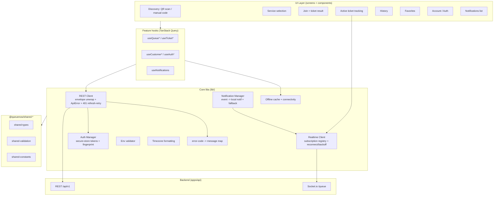

# Design Document

## Overview

The Customer Mobile App (`apps/mobile`) is a new React Native (Expo) application that is the customer-facing surface of the QueueNow queue-management system. It is a **pure consumer** of the existing NestJS backend (`apps/api`, base path `/api/v1`) and its Socket.io `/queue` gateway. It introduces no new backend behavior except where the customer journey requires capabilities that do not yet exist; those gaps are isolated in the **Backend Dependencies** section (Requirements 11, 12, 13).

The app mirrors the architectural patterns already proven in `apps/web`, adapted to React Native / Expo idioms:

| Concern         | `apps/web` pattern                                                                               | `apps/mobile` adaptation                                                                                                   |
| --------------- | ------------------------------------------------------------------------------------------------ | -------------------------------------------------------------------------------------------------------------------------- |
| REST client     | `fetch` wrapper, envelope unwrap, typed `ApiError`, single-flight 401 refresh-and-retry          | `fetch` wrapper with identical envelope/error semantics; refresh token sent in request body (no httpOnly cookie on device) |
| Token storage   | access token in memory (Zustand) + httpOnly refresh cookie                                       | both tokens in `expo-secure-store`; write-confirmed before "signed in" (R6.8/R6.9)                                         |
| Realtime        | one `socket.io-client` on `/queue`, ref-counted subscription registry, re-subscribe on reconnect | same registry model + bounded connect-and-resubscribe retry with backoff (R4.4/R4.5); driven by `AppState` + `NetInfo`     |
| Server state    | TanStack Query + query-key factory + invalidation                                                | identical TanStack Query model; React Native persistence for the offline active-ticket cache (R9)                          |
| Error copy      | `error.code` → message map (never message text)                                                  | identical map keyed on `ERROR_CODES` (R10.2/R10.4)                                                                         |
| Env             | Zod-validated `env` object, fail-fast                                                            | Zod-validated `env` from Expo public config, fail-fast                                                                     |
| Time formatting | `Intl.DateTimeFormat` in org timezone                                                            | same; org `timezone` from `IOrganization`                                                                                  |

The app reuses the three shared workspace packages and never redefines their types (R10.5, R14.3–R14.5):

- `@queuenow/shared-types` — `IOrganization`, `IService`, `IQueueTicket`, `ICustomerProfile`, `TicketStatus`, `NotificationType`, `ICustomerLoginResponse`, `ITokenPair`, `IQueueUpdateEvent`, `ITicketCalledEvent`, `ApiResponse<T>`.
- `@queuenow/shared-validation` — Zod schemas: `joinQueueSchema`, `customerRegisterSchema`, `loginSchema` (and inferred input types).
- `@queuenow/shared-constants` — `ERROR_CODES`, `WS_EVENTS`, `QUEUE_DEFAULTS`.

### Scope anchors (from requirements)

- **Anonymous-first** join (R2): no sign-in required; a stable `deviceFingerprint` re-associates anonymous tickets with the device.
- **Optional account** (R6, R7, R8): customer register/login unlocks history and favorites.
- **Realtime tracking** (R3, R4): live `position`/`status` from `ticket:update`, displayed verbatim from the backend (no client-side offset, R2.4).
- **Notifications** (R5, R13): `ticket:notification` → local notifications; in-app foreground fallback when permission denied; push registration with foreground-only v1 coverage given the backend FCM/APNs TODO.
- **Offline** (R9): read-only cache of the active ticket, stale indicator, manual + connectivity-restore refresh, live actions disabled offline.

## Architecture

### High-level layers



### Folder structure (`apps/mobile`)

Feature-based, mirroring `apps/web`. Navigation uses **expo-router** (file-based, the Expo-idiomatic analogue of TanStack Router's file-based routing). Routes stay thin and delegate to feature components.

```
apps/mobile/
├── app.config.ts                # Expo config (reads public env, plugins)
├── package.json                 # workspace deps on all three shared-* packages
├── tsconfig.json                # extends tsconfig.base.json
├── app/                         # expo-router routes (thin; delegate to features)
│   ├── _layout.tsx              # root: providers (QueryClient, Auth, Socket, Notif)
│   ├── index.tsx                # home / discovery entry
│   ├── scan.tsx                 # QR scanner (expo-camera)
│   ├── join/[orgId].tsx         # service selection + join
│   ├── ticket/[orgId]/[ticketId].tsx  # active ticket tracking
│   ├── (account)/
│   │   ├── _layout.tsx          # account tab group
│   │   ├── sign-in.tsx
│   │   ├── register.tsx
│   │   ├── history.tsx
│   │   ├── favorites.tsx
│   │   └── notifications.tsx
│   └── +not-found.tsx
├── src/
│   ├── features/
│   │   ├── discovery/           # QR parse + manual code + org/service fetch
│   │   ├── queue/               # join + ticket tracking hooks/components
│   │   ├── auth/                # customer register/login, secure session
│   │   ├── history/
│   │   ├── favorites/
│   │   └── notifications/
│   ├── components/              # shared, domain-agnostic UI (StaleBanner, OfflineBar…)
│   ├── lib/
│   │   ├── api/
│   │   │   ├── client.ts        # REST client (envelope/ApiError/refresh-retry)
│   │   │   ├── query-client.ts  # TanStack Query client config
│   │   │   ├── query-keys.ts    # query-key factory
│   │   │   ├── error-map.ts     # ERROR_CODES -> friendly copy
│   │   │   └── persist.ts       # active-ticket cache persistence
│   │   ├── socket.ts            # Realtime Client (registry + reconnect/backoff)
│   │   ├── auth/
│   │   │   ├── secure-store.ts  # expo-secure-store read/write/confirm
│   │   │   ├── auth-store.ts    # Zustand session state (in-memory mirror)
│   │   │   └── fingerprint.ts   # stable deviceFingerprint
│   │   ├── notifications/
│   │   │   ├── manager.ts       # event -> local notif + in-app fallback
│   │   │   └── push.ts          # expo-notifications push token registration
│   │   ├── connectivity.ts      # NetInfo + AppState bridge
│   │   ├── env.ts               # Zod-validated env, fail-fast
│   │   └── format.ts            # timezone-aware formatting
│   └── i18n/                    # centralized copy (EN MVP)
└── __tests__/ or colocated *.property.test.ts
```

### Workspace wiring

`apps/mobile/package.json` declares workspace dependencies (R14.3) using the pnpm workspace protocol, consistent with `apps/web`:

```jsonc
{
  "dependencies": {
    "@queuenow/shared-types": "workspace:*",
    "@queuenow/shared-validation": "workspace:*",
    "@queuenow/shared-constants": "workspace:*",
  },
}
```

All three packages are required at build time. The app boot performs an explicit presence assertion (a single module that imports a sentinel from each package); a missing package fails the Metro/TypeScript build rather than degrading to a subset (R14.4). Metro is configured for the monorepo (watch `packages/*`, resolve symlinked workspace packages).

### Navigation model

| Route                             | Screen                                                             | Auth                | Requirements        |
| --------------------------------- | ------------------------------------------------------------------ | ------------------- | ------------------- |
| `/`                               | Home / discovery entry (manual code + recent + favorites shortcut) | Anonymous           | R1.2                |
| `/scan`                           | QR scanner                                                         | Anonymous           | R1.1, R1.3          |
| `/join/[orgId]`                   | Service list + select + join                                       | Anonymous           | R1.4, R1.5, R2      |
| `/ticket/[orgId]/[ticketId]`      | Active-ticket tracking                                             | Anonymous           | R3, R4, R5, R9, R11 |
| `/(account)/sign-in`, `/register` | Auth                                                               | Anonymous → account | R6                  |
| `/(account)/history`              | Ticket history                                                     | Account             | R7                  |
| `/(account)/favorites`            | Favorites                                                          | Account             | R8                  |
| `/(account)/notifications`        | Persisted notification list                                        | Account             | R5.7                |

Deep links: a delivered push notification for an Active_Ticket routes to `/ticket/[orgId]/[ticketId]` on activation (R13.3).

## Components and Interfaces

### 1. REST Client (`lib/api/client.ts`) — Queue_Client transport

Mirrors `apps/web`'s `client.ts` with the same envelope and error semantics, adapted for device token handling.

- **Base URL** from validated `env.apiUrl` (no hardcoded URLs).
- **Envelope unwrap** (R10.1): success `{ success: true, data, meta }` → `{ data, meta }`. Error `{ success: false, error: { code, message, details } }` → throws typed `ApiError(code, message, details, httpStatus)` (R10.2). Well-formed-but-unrecognized bodies and non-JSON bodies → synthetic `ApiError(INTERNAL_ERROR)`. Network/timeout rejection → synthetic `ApiError(INTERNAL_ERROR)` so the UI can offer retry (R10.3).
- **Auth header** (R6.4, R6.5): before each request the client reads the access token from the Auth_Manager. If a token is present it sets `Authorization: Bearer <token>`. **Fail-closed**: for a request marked `authenticated`, if the token cannot be obtained/attached (secure-store read fails or returns null when one is required) the client throws an `ApiError` and **does not** send the request without the header (R6.5).
- **401 refresh-and-retry** (R12.1, R12.3): single-flight refresh shared across concurrent 401s; on success replace stored tokens and retry the original request exactly once; on failure clear tokens and signal return-to-sign-in (R12.4). Because R12 names the backend endpoint as not-yet-existing, refresh calls a configurable path (`POST /customers/refresh`, see Backend Dependencies) and **degrades gracefully**: if the endpoint returns 404/501 the client treats it as a refresh failure (clear tokens, route to sign-in) rather than looping.

```ts
export class ApiError extends Error {
  readonly code: string; // ERROR_CODES value or INTERNAL_ERROR
  readonly details?: Record<string, unknown>;
  readonly httpStatus?: number;
}

export interface ApiResult<TData> {
  data: TData;
  meta?: Meta;
}

export interface RequestOptions extends Omit<RequestInit, 'credentials'> {
  authenticated?: boolean; // when true, request fails closed without a token (R6.5)
}

export const apiClient: {
  get<T>(path: string, options?: RequestOptions): Promise<ApiResult<T>>;
  post<T>(path: string, body?: unknown, options?: RequestOptions): Promise<ApiResult<T>>;
  patch<T>(path: string, body?: unknown, options?: RequestOptions): Promise<ApiResult<T>>;
  delete<T>(path: string, options?: RequestOptions): Promise<ApiResult<T>>;
};
```

### 2. Endpoint map (consumed verbatim from the backend)

| Capability                  | Method + path                                                   | Auth                  | Req              |
| --------------------------- | --------------------------------------------------------------- | --------------------- | ---------------- |
| Org queue status / services | `GET /organizations/:orgId/queue/status?serviceId=`             | Public                | R1.2, R1.4       |
| Join queue                  | `POST /organizations/:orgId/queue/join`                         | Public                | R2.1             |
| Ticket status               | `GET /organizations/:orgId/queue/ticket/:ticketId`              | Public                | R3.2, R9.3, R9.4 |
| Customer register           | `POST /customers/register`                                      | Public                | R6.1             |
| Customer login              | `POST /customers/login`                                         | Public                | R6.2             |
| Ticket history              | `GET /customers/history`                                        | Bearer                | R7.1             |
| Favorites list              | `GET /customers/favorites`                                      | Bearer                | R8.1             |
| Add favorite                | `POST /customers/favorites/:orgId`                              | Bearer                | R8.2             |
| Remove favorite             | `DELETE /customers/favorites/:orgId`                            | Bearer                | R8.3             |
| Notifications list          | `GET /notifications?limit=&offset=`                             | Bearer                | R5.7             |
| Register push token         | `POST /notifications/push-token`                                | Bearer                | R13.1            |
| **Leave/cancel ticket**     | _new_ (see Backend Dependencies, R11)                           | Public+ownership      | R11              |
| **Customer token refresh**  | _new_ `POST /customers/refresh` (see Backend Dependencies, R12) | refresh token in body | R12              |

> Discovery note (R1.2): The QR payload produced by `qr-code.service.ts` is a deep link URL of the form `{APP_BASE_URL}/join/{slug}?service={serviceId}`. The app parses the `slug` (and optional `serviceId`) from the scanned URL, then resolves the organization's active services and current status via `GET /organizations/:orgId/queue/status`, which returns `organizationName` plus a per-service array (`id`, `name`, `prefix`, waiting/serving counts, `estimatedWaitMinutes`). Because the public status endpoint is org-id-scoped, slug→orgId resolution uses the same public status/lookup path the web kiosk uses for `slug` joins.

### 3. TanStack Query usage & query keys (`lib/api/query-keys.ts`)

Identical factory style to `apps/web`. Keys are `as const` tuples; mutations invalidate the relevant keys; the socket bridge invalidates ticket keys on `ticket:update`.

```ts
export const queryKeys = {
  orgStatus: (orgId: string, serviceId?: string) => ['org-status', orgId, serviceId] as const,
  ticket: (orgId: string, ticketId: string) => ['ticket', orgId, ticketId] as const,
  history: () => ['customer-history'] as const, // account-scoped
  favorites: () => ['customer-favorites'] as const, // account-scoped
  notifications: () => ['notifications'] as const, // account-scoped
} as const;
```

Invalidation rules:

- Join success → invalidate `orgStatus(orgId, serviceId)`.
- `ticket:update`/`ticket:notification` for the tracked ticket → invalidate `ticket(orgId, ticketId)` so REST stays the source of truth (no parallel store).
- Add/remove favorite → invalidate `favorites()`.
- Sign-out → **remove** `history()`, `favorites()`, `notifications()` from the cache so no account data (including cached history) survives the session (R7.4).
- Connectivity restored or manual refresh → invalidate/refetch `ticket(orgId, ticketId)` (R9.3, R9.4).

### 4. Realtime Client (`lib/socket.ts`) — Realtime_Client

One `socket.io-client` connection on `/queue`. Reuses the web's **ref-counted subscription registry** so re-subscription after reconnect is deterministic, extended with a **bounded connect-and-resubscribe retry** (R4.4/R4.5).

```ts
export interface TicketSubscription {
  ticketId: string;
} // subscribe:ticket
export interface RoomSubscription {
  orgId: string;
  serviceId?: string;
} // subscribe

export function subscribeTicket(ticketId: string): void; // R4.1
export function unsubscribeTicket(ticketId: string): void; // R4.3
export function subscribeRoom(d: RoomSubscription): void; // R4.2
export function unsubscribeRoom(d: RoomSubscription): void; // R4.3
export function reconnectNow(): void; // manual trigger (R4.4)
export type SocketStatus = 'idle' | 'connecting' | 'connected' | 'reconnecting' | 'disconnected';
```

Behaviors:

- **Events from `WS_EVENTS`** only (R4.6): client→server `SUBSCRIBE`, `UNSUBSCRIBE`, `SUBSCRIBE_TICKET`; server→client `QUEUE_UPDATE`, `TICKET_CALLED`, `TICKET_UPDATE`, `TICKET_NOTIFICATION`, `SUBSCRIBED`.
- **On `connect`/reconnect** the registry re-emits `subscribe`/`subscribe:ticket` for every tracked entry (R4.4).
- **Re-subscribe verification** (R4.5): after a (re)connect, the client awaits acknowledgement (`SUBSCRIBED` for room subs / first `ticket:update` snapshot request) within a short window. If acknowledgement does not arrive, the reconnection is treated as **failed**, and the whole connect-and-resubscribe cycle is retried with a **bounded** number of attempts using **exponential backoff** (e.g. base 500 ms, factor 2, cap 30 s, max N attempts). When attempts are exhausted, status settles on `disconnected` and the UI surfaces a manual-reconnect affordance.
- **Triggers for reconnect** (R4.4): socket-level connection loss, a `NetInfo` connectivity-change to "connected", `AppState` transition to `active` (foreground), and an explicit user-initiated `reconnectNow()`.
- **Bridge** (R3.3): on `ticket:update` for the tracked ticket, update within 2 s by invalidating `queryKeys.ticket(orgId, ticketId)` (TanStack Query refetch) and/or patching the cached ticket; on `ticket:notification`, hand the payload to the Notification_Manager.
- Connection status exposed via a tiny Zustand store for the reconnecting indicator and offline UI.

### 5. Auth Manager (`lib/auth/*`)

- **Anonymous-first**: no session needed to join. A stable `deviceFingerprint` (R2.3) is generated once and persisted in secure storage (e.g. derived from `expo-application` install id / `Crypto.randomUUID()` persisted on first launch), reused on every join and for ownership-scoped leave/cancel (R11).
- **Secure token storage** (R6.7): access + refresh tokens persisted with `expo-secure-store` (Keychain/Keystore) — never `AsyncStorage`/plain storage.
- **Write-confirmation** (R6.8, R6.9): after register/login, the Auth_Manager writes both tokens, then **reads them back** to confirm the write succeeded before flipping session state to "signed in". If secure storage is unavailable or read-back does not match, it surfaces an error and remains signed-out (no partial session).
- **Sign-out** (R6.6): delete both tokens from secure storage; clear the in-memory mirror; remove account-scoped query data (R7.4).
- **Validation** (R6.10, R2.7): account input validated with `customerRegisterSchema`/`loginSchema`, join input with `joinQueueSchema`, before sending.

```ts
export interface CustomerSession {
  customer: ICustomerLoginResponse['customer'];
  // tokens are NOT held only in memory long-term; persisted in secure-store
}
export const authManager: {
  register(input: CustomerRegisterInput): Promise<CustomerSession>; // R6.1, R6.8
  login(input: LoginInput): Promise<CustomerSession>; // R6.2, R6.8
  signOut(): Promise<void>; // R6.6
  getAccessToken(): Promise<string | null>; // R6.4
  getDeviceFingerprint(): Promise<string>; // R2.3
  isSignedIn(): boolean;
};
```

### 6. Notification Manager (`lib/notifications/manager.ts`)

- Subscribes to `ticket:notification` events for the Active_Ticket and maps `NotificationType` (R5.6):
  - `ALMOST_TURN` → "almost your turn" local notification (R5.1)
  - `YOUR_TURN` → "your turn" local notification identifying the counter name (R5.2)
  - `SKIPPED` → "ticket skipped" local notification (R5.3)
- Alerts are surfaced **only in response to the event** and never proactively (R5.4).
- **Foreground fallback** (R5.5): if local-notification permission is denied **and** the app is foreground/active, the alert is surfaced in-app via a **persistent in-app banner** and/or an **audible alert** (using `expo-av`/notification sound).
- **Push registration** (R13.1): when signed in and permission granted, obtain an Expo/native push token and register it via `POST /notifications/push-token`. Given the backend FCM/APNs delivery is a TODO, **v1 turn-alert coverage is foreground/in-app** (R13.4): if the token is not successfully registered (or backend delivery is absent), background/closed-app push is simply unavailable and the in-app + foreground mechanisms of R5 remain the guaranteed path.
- **Deep link on activation** (R13.3): when a delivered push for an Active_Ticket is tapped, navigate to `/ticket/[orgId]/[ticketId]`.

### 7. Offline cache & connectivity (`lib/api/persist.ts`, `lib/connectivity.ts`)

- On every successful Active_Ticket load, persist its last-known details to the device (R9.1) (TanStack Query persistence scoped to the `ticket` key, or an explicit JSON record in storage). The cache is **read-only**.
- `NetInfo` exposes connectivity; while offline, the tracking screen renders the **cached** ticket with a **stale indicator** (R9.2) and **disables live actions** (join, leave/cancel, manual refresh-that-needs-network), presenting the reason (R9.5).
- On connectivity restore: refetch the ticket via REST and the Realtime_Client re-establishes subscriptions (R9.3).
- Manual pull-to-refresh refetches the ticket via REST (R9.4).

### 8. Error-code map (`lib/api/error-map.ts`)

Identical contract to web: maps an `ApiError.code` (from `ERROR_CODES`) to friendly copy from the centralized i18n catalog; unknown/missing codes fall back to generic copy. The app **keys on the code, never on message text** (R10.2, R10.4). `QUEUE_FULL` maps to the queue-full message and the join flow suppresses ticket issuance/display (R2.5).

### 9. Env validator (`lib/env.ts`)

Zod-validated public config (`EXPO_PUBLIC_API_URL`, `EXPO_PUBLIC_WS_URL`), fail-fast with a named error that lists offending variables, mirroring `apps/web`'s `env.ts`. No hardcoded URLs anywhere.

### 10. Timezone formatting (`lib/format.ts`)

Reuse the web policy: format displayed times in the org timezone (`IOrganization.timezone`, IANA), via `Intl.DateTimeFormat` with explicit `timeZone`; wait estimates shown in human terms ("~15 min"). Dates sent to the API are ISO-8601.

## Data Models

The app **does not** redefine shared domain types (R10.5, R14.5). It composes view models from shared types plus the backend's response augmentations.

### Shared types reused (from `@queuenow/shared-types`)

`IOrganization`, `IService`, `IQueueTicket`, `ICustomerProfile`, `TicketStatus`, `NotificationType`, `ICustomerLoginResponse`, `ITokenPair`, `IQueueUpdateEvent`, `ITicketCalledEvent`, `ApiResponse<T>`.

### App-local view models (composition only)

```ts
// Parsed from a scanned QR deep link (qr-code.service URL shape) or manual entry.
export interface DiscoveryTarget {
  slug?: string;
  orgId?: string;
  serviceId?: string; // present when a service-specific QR was scanned (R1.1)
  source: 'qr' | 'manual';
}

// The join response augments IQueueTicket with backend-computed position/wait.
export interface JoinedTicket extends IQueueTicket {
  position: number; // displayed verbatim (R2.4)
  estimatedWaitMinutes: number; // displayed verbatim (R2.4)
  service?: { id: string; name: string; prefix: string; avgServingTime: number };
}

// Ticket status response: position/estimatedWaitMinutes are null for terminal states.
export interface TicketStatusView extends IQueueTicket {
  position: number | null;
  estimatedWaitMinutes: number | null;
  counter?: { id: string; name: string } | null; // counter name when CALLED (R3.4)
  service?: { id: string; name: string; prefix: string; avgServingTime: number };
}

// Offline cache record for the active ticket (R9.1, R9.2).
export interface CachedActiveTicket {
  orgId: string;
  ticket: TicketStatusView;
  cachedAt: string; // ISO; drives the "may be out of date" indicator
}

// Notification list item (from GET /notifications).
export interface NotificationListItem {
  id: string;
  type: NotificationType;
  status: string;
  createdAt: string;
  ticket?: {
    id: string;
    ticketNumber: string;
    orgId: string;
    service?: { id: string; name: string };
  };
}
```

### Persisted device state

| Key (secure / storage)                      | Purpose                                      | Req        |
| ------------------------------------------- | -------------------------------------------- | ---------- |
| `secure:accessToken`, `secure:refreshToken` | customer session tokens (expo-secure-store)  | R6.7, R6.8 |
| `secure:deviceFingerprint`                  | stable anonymous device id                   | R2.3       |
| `store:activeTicket`                        | read-only offline cache of the Active_Ticket | R9.1       |
| `secure:pushToken` (mirror)                 | last-registered push token                   | R13.1      |

### Socket event payloads (from the gateway)

- `ticket:update` carries the queue-update payload `{ type, ticket: { id, ticketNumber, status, serviceId?, counterName?, position? } }` (`IQueueUpdateEvent`). Delivered to the `ticket:<ticketId>` room.
- `ticket:notification` carries `{ type: NotificationType, ... }` delivered to the `ticket:<ticketId>` room.
- `queue:update` (org/service rooms) and `queue:ticket-called` are available for live service-status views (R4.2).

## Correctness Properties

_A property is a characteristic or behavior that should hold true across all valid executions of a system — essentially, a formal statement about what the system should do. Properties serve as the bridge between human-readable specifications and machine-verifiable correctness guarantees._

These properties target the **pure, input-varying logic** of the mobile app: the network layer (envelope/error/auth-header/refresh), the socket bridge and subscription lifecycle, secure-token invariants, the offline cache, and error-code mapping. They are derived from the prework analysis above, after consolidating logically redundant criteria. Infrastructure wiring (native modules, real sockets, the not-yet-existing backend endpoints) is covered by integration/smoke tests in the Testing Strategy, not by these properties.

Each property is implemented by a single `fast-check` property-based test (minimum 100 iterations) tagged with `// Feature: customer-mobile-app, Property {n}: {text}`.

### Property 1: QR / deep-link parse round-trips

_For any_ organization slug and optional serviceId, building the join deep-link URL in the `qr-code.service` format (`{base}/join/{slug}` or `{base}/join/{slug}?service={serviceId}`) and then parsing it into a `DiscoveryTarget` yields the same slug and serviceId (and `source: 'qr'`).

**Validates: Requirements 1.1**

### Property 2: Discovery join-availability decision

_For any_ discovery result, a join action is presented **iff** the organization resolved to an active org exposing at least one active service; for any error outcome whose code is `ORG_NOT_FOUND` or `ORG_INACTIVE`, no join action is presented and an error is shown.

**Validates: Requirements 1.3, 1.4**

### Property 3: Join request construction and validation

_For any_ join inputs (orgId, selected serviceId, optional name/phone, session state), the constructed request: targets `POST /organizations/:orgId/queue/join`; always includes a non-empty `deviceFingerprint`; includes `customerName`/`customerPhone` exactly when provided; includes `customerProfileId` exactly when signed in; and is sent **iff** `joinQueueSchema` validates the body — invalid input never reaches the network.

**Validates: Requirements 2.1, 2.2, 2.3, 2.6, 2.7**

### Property 4: Position and wait are displayed verbatim (no client offset)

_For any_ join or ticket-status response, the displayed `position` equals the backend `position` and the displayed `estimatedWaitMinutes` equals the backend `estimatedWaitMinutes`, with no client-side arithmetic applied.

**Validates: Requirements 2.4**

### Property 5: Ticket status projection

_For any_ ticket-status response, the projected view: exposes live `position`/`estimatedWaitMinutes` only when `status` is `WAITING`; includes the assigned counter name when `status` is `CALLED` and a counter is present; and exposes a terminal flag with no live position/wait when `status` is `COMPLETED` or `SKIPPED`.

**Validates: Requirements 3.1, 3.4, 3.5**

### Property 6: Ticket-update bridge targets the matching query key

_For any_ tracked `(orgId, ticketId)` and any `ticket:update`/`ticket:notification` event for that `ticketId`, the bridge produces exactly the `queryKeys.ticket(orgId, ticketId)` invalidation key and produces no key for events whose `ticketId` is not tracked.

**Validates: Requirements 3.3**

### Property 7: Subscription lifecycle is consistent across mount, unmount, and reconnect

_For any_ sequence of balanced `subscribe`/`unsubscribe` calls (ticket and room), the registry's tracked set equals the set of currently-mounted subscribers; the first subscriber for an entry emits exactly one `subscribe`/`subscribe:ticket` and the last unsubscribe emits exactly one `unsubscribe`, using only `WS_EVENTS` names.

**Validates: Requirements 4.1, 4.2, 4.3, 4.6**

### Property 8: Reconnect re-issues exactly the tracked subscriptions

_For any_ registry state, a (re)connect — whether triggered by connection loss, a network-change to connected, app foregrounding, or a manual reconnect — re-emits a `subscribe`/`subscribe:ticket` for exactly the currently-tracked entries (no more, no fewer), and connectivity-restore triggers the same re-emission.

**Validates: Requirements 4.4, 9.3**

### Property 9: Connect-and-resubscribe retry schedule is bounded with exponential backoff

_For any_ attempt index `n`, the retry delay equals `min(base * factor^n, cap)` (monotonically non-decreasing in `n`), and the number of connect-and-resubscribe attempts never exceeds the configured maximum; when re-subscription acknowledgement fails, the cycle is retried under this schedule and stops after the bound is reached.

**Validates: Requirements 4.5**

### Property 10: Turn-notification mapping is exhaustive and event-driven

_For any_ `ticket:notification` event, the produced turn alert is determined solely by its `NotificationType`: `ALMOST_TURN` → "almost your turn"; `YOUR_TURN` → "your turn" including the counter name; `SKIPPED` → "ticket skipped". _For any_ sequence of events, the number of turn alerts produced equals the number of turn-related events consumed (no alert is produced without a corresponding event).

**Validates: Requirements 5.1, 5.2, 5.3, 5.4, 5.6**

### Property 11: Notification channel selection

_For any_ combination of `(permissionGranted, appStateForeground, eventType)`, the selected delivery channel is: an OS local notification when permission is granted; otherwise, when permission is denied and the app is foreground/active, an in-app persistent banner and/or audible alert. The absence of a registered push token never suppresses the in-app/foreground alert.

**Validates: Requirements 5.5, 13.4**

### Property 12: Reverse-chronological ordering

_For any_ list of `createdAt`-bearing items (notification list or ticket history), the displayed order is non-increasing by `createdAt` (most recent first).

**Validates: Requirements 5.7, 7.3**

### Property 13: List rows expose their required fields

_For any_ history list, every rendered row exposes the organization name, service name, `ticketNumber`, and `TicketStatus`; _for any_ favorites list, every rendered row exposes the organization name and a view-services action target.

**Validates: Requirements 7.2, 8.4**

### Property 14: Secure-token write-confirmation invariant

_For any_ token pair, after register/login the session is treated as "signed in" **iff** a read-back from secure storage returns the same tokens; if the write or read-back fails (or secure storage is unavailable), the session remains signed-out, an error is surfaced, and the store holds no tokens. After sign-out, and after any failed authentication, the secure store holds no tokens.

**Validates: Requirements 6.1, 6.2, 6.3, 6.6, 6.7, 6.8, 6.9**

### Property 15: Authenticated requests attach the Bearer token or fail closed

_For any_ request marked authenticated: when a token is present, the built headers include `Authorization: Bearer <token>`; when the token cannot be retrieved (null or read failure), no network send occurs and an error is raised — the request is never sent without the token.

**Validates: Requirements 6.4, 6.5**

### Property 16: Account input validates against the shared schema before sending

_For any_ account input, the register/login request is sent **iff** the corresponding shared schema (`customerRegisterSchema` / `loginSchema`) validates it; invalid input never reaches the network.

**Validates: Requirements 6.10**

### Property 17: Account data isolation when signed out

_For any_ previously-cached account data (history, favorites, notifications), while signed out the corresponding view exposes zero entries and presents the account prompt, and the account-scoped query cache holds no entries.

**Validates: Requirements 7.4**

### Property 18: Offline cache round-trip, staleness, and action gating

_For any_ loaded Active_Ticket, the offline cache round-trips (read-back equals what was written); while offline, the view renders exactly the cached ticket with the stale ("may be out of date") indicator set; and live actions are enabled **iff** online — when offline they are disabled with a stated reason.

**Validates: Requirements 9.1, 9.2, 9.5**

### Property 19: Response envelope unwrapping and failure normalization

_For any_ success envelope `{ success: true, data, meta }`, the client returns `{ data, meta }`; _for any_ error envelope `{ success: false, error: { code, message, details } }`, it throws `ApiError` whose `code` equals the envelope code; _for any_ non-JSON body, unrecognized shape, or network/timeout rejection, it throws `ApiError(INTERNAL_ERROR)` and never returns data.

**Validates: Requirements 10.1, 10.2, 10.3**

### Property 20: Error-code-to-message mapping depends only on the code

_For any_ error envelope with a fixed `code` and arbitrary `message` text, the resolved user-facing message depends only on the code (unknown/missing codes resolve to the generic fallback); in particular, `QUEUE_FULL` resolves to the queue-full message and the join flow yields a no-ticket error state.

**Validates: Requirements 2.5, 10.2, 10.4, 11.4**

### Property 21: Single-flight 401 refresh-and-retry is bounded

_For any_ authenticated request that receives a `401`, exactly one token refresh is performed and the original request is retried at most once with the refreshed token; concurrent `401`s share a single in-flight refresh; and when the refresh fails, the stored tokens are cleared, the return-to-sign-in signal fires, and no further retry occurs.

**Validates: Requirements 12.1, 12.3, 12.4**

## Error Handling

The app handles errors in three layers, all keyed on machine-readable codes (never message text, R10.4):

1. **Transport layer (`lib/api/client.ts`)**
   - Error envelope → `ApiError(code, message, details, httpStatus)` (R10.2).
   - Non-JSON / unrecognized shape / network / timeout → `ApiError(INTERNAL_ERROR)` so the UI can offer retry (R10.3).
   - Authenticated request without an attachable token → fail closed (R6.5).
   - `401` → single-flight refresh-and-retry; on failure clear tokens + route to sign-in (R12).

2. **Domain mapping (`lib/api/error-map.ts`)**
   - `ApiError.code` → friendly i18n copy via `ERROR_CODES`; unknown/missing → generic fallback.
   - Notable mappings: `QUEUE_FULL` → queue-full copy with **no ticket issued** (R2.5); `AUTH_INVALID_CREDENTIALS` → invalid-credentials copy with **no token stored** (R6.3); `ORG_NOT_FOUND`/`ORG_INACTIVE` → discovery error with **no join action** (R1.3); cancel-not-WAITING errors (e.g. `QUEUE_INVALID_STATUS`/`TICKET_NOT_FOUND`) → message + **ticket refetch** (R11.4).

3. **UX layer**
   - Every data region has explicit loading (skeleton), empty, and error states (no bare spinner).
   - Transient action success/failure via toast; field errors mapped from `error.details` back to form inputs.
   - Offline: live actions disabled with a stated reason; cached ticket shown with stale indicator (R9.2, R9.5).
   - Network/timeout: inline retry affordance (R10.3).
   - Secure-storage failure: surface an error and remain signed-out (R6.9).

## Testing Strategy

**Dual approach.** Property-based tests verify the universal properties above across many generated inputs; example/integration tests verify concrete wiring and external boundaries. Both are necessary.

**Property-based testing.**

- Library: **fast-check** (the project's chosen PBT library; matches `apps/web`).
- Implement **each** correctness property with a **single** property test, minimum **100 iterations**.
- Tag every property test with `// Feature: customer-mobile-app, Property {n}: {property text}`.
- Keep the logic under test **pure** by extracting it behind small functions/adapters (e.g. `buildJoinRequest`, `projectTicketStatus`, `queueKeysForEvent`, `selectNotificationChannel`, `retryDelay`, `unwrapEnvelope`, `messageForErrorCode`, secure-store adapter), mirroring the web app where `queueKeysForEvent` is exported pure for its property test.
- External dependencies are injected/mocked at the boundary: a mock REST client, a mock socket, an in-memory secure-store adapter (with injectable write/read failures for R6.9), a fake `NetInfo`/`AppState`, and a fake notifications module. No test hits a real backend, device keychain, or live socket.

**Example / unit tests** (input-invariant or specific scenarios):

- Discovery manual-code happy path and rendering (R1.2).
- Ticket view opens and calls `GET .../ticket/:ticketId` (R3.2).
- Push payload → deep link `/ticket/[orgId]/[ticketId]` (R13.3).

**Integration tests** (boundaries / external behavior, 1–3 examples):

- Query hooks call the correct paths/methods: history (R7.1), favorites list/add/remove (R8.1–8.3), notifications list (R5.7), push-token registration when signed-in + permission granted (R13.1), manual refresh refetch (R9.4).
- Socket connect + `subscribe:ticket` on the ticket view (R4.1) against a mock socket server.

**Smoke / build checks** (one-time setup, not PBT):

- Workspace deps present and all three shared packages resolvable; build fails on a missing package (R14.3, R14.4).
- Shared-type reuse / no local redefinition via type-check + lint (R10.5, R14.5).
- Runs on iOS and Android Expo runtime in CI (R14.1, R14.2).

**Backend-dependency tests** (deferred until the endpoints exist — see below): customer refresh endpoint (R12.2), customer leave/cancel endpoint (R11.2), and push delivery (R13.2) get backend integration tests when implemented. Until then the app paths are covered by Properties 9, 11, 20, 21 against mocks, and degrade as specified.

## Backend Dependencies

Three customer-journey capabilities are **not yet implemented** in `apps/api`. The mobile app is designed to **degrade gracefully** until each lands, and the proposed endpoint shapes are kept consistent with existing controllers (`customer.controller.ts`, `queue.controller.ts`, `notification.service.ts`).

### R11 — Customer leave/cancel ticket endpoint

**Current state:** `queue.controller.ts` exposes only staff-authorized transitions (`call-next`, `recall`, `skip`, `complete`, `rejoin`). There is no customer-facing way to leave a `WAITING` ticket.

**Proposed addition:** a public, ownership-scoped endpoint mirroring the existing public queue routes:

```
POST /organizations/:orgId/queue/ticket/:ticketId/cancel
Body: { deviceFingerprint?: string; customerProfileId?: string }
```

- Authorization is by **ownership**, not staff role: the ticket's `deviceFingerprint` or `customerProfileId` must match the request (re-using the same identifiers the join flow already stores). Marked `@Public()` like `join` and `ticket/:ticketId`.
- Transitions the caller's own `WAITING` ticket out of the active queue (e.g. to a `CANCELLED`/terminal state or `SKIPPED`); rejects non-`WAITING` tickets with an existing error code (`QUEUE_INVALID_STATUS`) so the app can map it (R11.4).
- Emits a `queue:update`/`ticket:update` so the device updates live.

**Degradation until implemented:** the Leave button is shown but, on a 404/501 (or feature flag off), the app maps the failure to a friendly "not available yet" message and keeps the ticket visible; no client-side faking of cancellation. App-side logic (request construction, post-cancel view transition + unsubscribe, error refetch) is covered by Properties 7 and 20.

### R12 — Customer token-refresh endpoint

**Current state:** `customer.service.ts` issues access + refresh tokens and stores `CustomerSession` rows, but no customer refresh endpoint exists. The web `auth.controller.ts` refresh reads the refresh token from an **httpOnly cookie** — that mechanism is browser-specific and unavailable on-device.

**Proposed addition:** a public endpoint that accepts the refresh token **in the request body** (mobile holds it in secure storage, not a cookie), consistent with `CustomerService.generateTokens`/`CustomerSession`:

```
POST /customers/refresh
Body: { refreshToken: string }
Returns: { customer, tokens: { accessToken, refreshToken } }   // same shape as login (ICustomerLoginResponse)
```

- Verifies the customer refresh JWT (`JWT_REFRESH_SECRET`), validates the backing `CustomerSession`, rotates the session, and returns a new token pair.
- Invalid/expired refresh → an auth error code (`AUTH_TOKEN_EXPIRED`/`AUTH_UNAUTHORIZED`) so the app clears tokens and routes to sign-in (R12.4).

**Degradation until implemented:** the API client's refresh path points at `POST /customers/refresh`; a 404/501 is treated as a refresh failure (clear tokens → sign-in), so an expired access token simply requires re-login rather than looping. The single-flight, bounded refresh-and-retry control flow is covered by Property 21 against a mock.

### R13 — Push notification delivery (FCM/APNs)

**Current state:** `notification.service.ts` records notifications and reads the stored `pushToken`, but actual FCM/APNs delivery is a `TODO` (it only logs and marks `SENT`). `POST /notifications/push-token` already persists the token.

**Proposed addition (backend):** integrate a push provider (FCM/APNs, or Expo Push) in `NotificationService.sendNotification` to deliver `YOUR_TURN`/`ALMOST_TURN`/`SKIPPED` to the stored `pushToken` (R13.2). The token-registration endpoint already exists and needs no change.

**Degradation until implemented (v1 scope):** the app registers its push token when signed-in + permission granted (R13.1), and handles a delivered push by deep-linking to the ticket (R13.3). Because backend delivery is absent, **v1 turn-alert coverage is foreground/in-app only** via the Realtime_Client + Notification_Manager (R5, R13.4): when the app is foregrounded or active, `ticket:notification` events drive local/in-app alerts. Background/closed-app alerts begin working automatically once the backend delivery lands — no app change required. The channel-selection guarantee (in-app/foreground always available regardless of push) is covered by Property 11.
