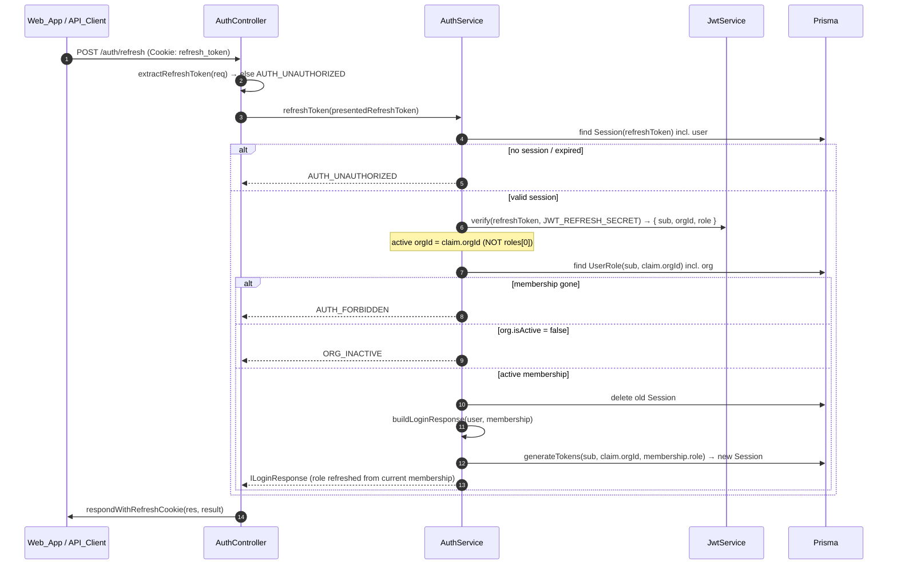

# Design Document

## Overview

Organization switching makes QueueNow's flat multi-org model usable. A `User`
holds at most one `UserRole` per `Organization` (`@@unique([userId, orgId])`),
so membership is the `UserRole` record and the user's role can differ per org.
Today `AuthService.login()` and `AuthService.refreshToken()` both hardcode
`primaryRole = user.roles[0]` and bake that single `(orgId, role)` into the JWT.
That is the **single-org lock** bug: a user invited to a second org is silently
pinned to `roles[0]` forever, with no way to reach the others and no way for a
refresh to preserve a different active org.

This design does four things:

1. **Adds two authenticated endpoints** on `AuthController`:
   - `GET /api/v1/auth/organizations` — list the caller's memberships.
   - `POST /api/v1/auth/switch-organization` — re-issue tokens scoped to a target
     org + the caller's role there, rotating the session.
2. **Fixes the core bug** by making the active org _explicit and derived_:
   - `login()` selects a **deterministic default** (earliest active membership,
     tie-broken by `orgId`).
   - `refreshToken()` reads the active `orgId` from the **presented refresh-token
     JWT claim** (not `roles[0]`), re-validates membership, and refreshes the
     role from the _current_ membership.
3. **Keeps `generateTokens` as the single source of truth** for token issuance
   and session creation, and rotates the `Session` row on every switch/refresh.
4. **Adds the frontend Org_Switcher** in the AppShell plus the query/mutation
   hooks and the post-switch side effects (token swap, socket reconnect, cache
   invalidation).

The existing auth model is preserved exactly: the access token lives only in web
memory, the refresh token is an httpOnly `SameSite=Lax` cookie scoped to
`/api/v1/auth`, every response uses the `{ success, data, meta }` / error
envelope, and only the existing `ERROR_CODES` are used. **No Prisma migration is
required** — every field this feature reads (`UserRole.createdAt`,
`Organization.isActive`, `Session.refreshToken`) already exists.

### Key Investigation Findings

- **No global auth guard.** `app.module.ts` registers no `APP_GUARD`. Each
  feature controller opts in with `@UseGuards(JwtAuthGuard, RolesGuard)`.
  `AuthController` is _not_ class-level `@Public()`; instead `register`/`login`/
  `refresh` each carry their own `@Public()`, and `logout` is currently
  unguarded. **Decision:** the two new routes get a per-route
  `@UseGuards(JwtAuthGuard)` so they require a valid access token without making
  the public endpoints authenticated. (See Components for the rationale vs. a
  class-level guard.)
- **`req.user` shape.** `JwtStrategy.validate()` loads the `User`, checks
  `isActive`, and returns `IAuthenticatedUser { id, email, fullName, orgId, role,
type:'staff' }` where `orgId`/`role` come straight from the _access-token_
  claims. So a handler can read `@CurrentUser() user` and trust `user.id` as the
  authenticated user and `user.orgId` as the currently-active org.
- **Refresh reads the cookie only.** `AuthController.refresh` extracts the token
  from the `refresh_token` httpOnly cookie and never from the body;
  `respondWithRefreshCookie` sets the new cookie and strips `refreshToken` from
  the JSON body. The new switch endpoint reuses both helpers verbatim.
- **Refresh JWT carries `orgId`.** `generateTokens` signs the _same_ payload
  `{ sub, orgId, role, type:'staff' }` for both access and refresh tokens (the
  refresh token just uses `JWT_REFRESH_SECRET` + 7d expiry). So the active org is
  already encoded in the refresh token — `refreshToken()` only needs to _read_
  it instead of falling back to `roles[0]`.
- **Error envelope.** Domain exceptions extend `HttpException` with a response
  body `{ code, message, details? }`; `HttpExceptionFilter` emits
  `{ success:false, error:{ code, message, details } }`. New exceptions follow
  the existing `OrgNotFoundException` / `PlanLimitExceededException` pattern.

## Architecture

### Request flows

```mermaid
sequenceDiagram
    autonumber
    participant Web as Web_App (OrgSwitcher)
    participant Ctl as AuthController
    participant Guard as JwtAuthGuard
    participant Svc as AuthService
    participant DB as Prisma

    Web->>Ctl: POST /auth/switch-organization { orgId }<br/>Authorization: Bearer access<br/>Cookie: refresh_token
    Ctl->>Guard: validate access token
    Guard-->>Ctl: req.user { id, orgId(active), role }
    Note over Ctl: DTO validation (orgId is UUID) → else VALIDATION_ERROR
    Ctl->>Svc: switchOrganization(userId, targetOrgId, presentedRefreshToken)
    Svc->>DB: find UserRole(userId, targetOrgId) incl. org
    alt no membership / org missing
        Svc-->>Ctl: AUTH_FORBIDDEN (no enumeration)
    else membership exists but org.isActive = false
        Svc-->>Ctl: ORG_INACTIVE
    else active membership
        Svc->>DB: delete Session(refreshToken = presented)
        Svc->>DB: generateTokens(userId, targetOrgId, role) → create Session
        Svc-->>Ctl: ILoginResponse { user, organization, tokens }
    end
    Ctl->>Web: respondWithRefreshCookie(res, result)<br/>Set-Cookie refresh_token; body tokens.accessToken only
    Web->>Web: setSession → reconnect socket → invalidate org-scoped caches
```

### Refresh preserves the active org



### Layering

- **Controller** (`AuthController`) — HTTP concerns only: guards, DTO binding,
  cookie read/write via the existing `extractRefreshToken` /
  `respondWithRefreshCookie` helpers. No business logic.
- **Service** (`AuthService`) — all org-resolution and token logic. The new
  `listOrganizations`, `switchOrganization`, the rewritten `login`/`refreshToken`,
  and the shared private helpers `selectDefaultMembership`,
  `resolveActiveMembership`, and `buildLoginResponse`.
- **Persistence** (`PrismaService`) — `userRole` + `organization` reads and
  `session` create/delete. Unchanged models.

## Components and Interfaces

### Backend

#### `SwitchOrganizationDto` (`apps/api/src/modules/auth/dto/switch-organization.dto.ts`)

```ts
import { IsUUID } from 'class-validator';
import { ApiProperty } from '@nestjs/swagger';

export class SwitchOrganizationDto {
  @ApiProperty({ format: 'uuid', description: 'Target organization id to switch to' })
  @IsUUID()
  orgId!: string;
}
```

`Organization.id` is `@default(uuid())`, so `@IsUUID()` is the correct validator.
A missing/non-UUID `orgId` is rejected by the global `ValidationPipe` before the
handler runs (R2.12, R7.6). The matching shared Zod schema
`switchOrganizationSchema = z.object({ orgId: z.string().uuid() })` is added to
`@queuenow/shared-validation` so the web mutation can validate symmetrically.

> **Validation-error code note.** The global `ValidationPipe` in `main.ts`
> currently uses the default `BadRequestException`, which the
> `HttpExceptionFilter` would surface with `code: 'ERROR'`, not
> `VALIDATION_ERROR`. To satisfy R7.6 we configure the pipe's `exceptionFactory`
> to throw a domain `ValidationException` carrying
> `{ code: ERROR_CODES.VALIDATION_ERROR, message, details }`. This is a small,
> centralized change applied once in `main.ts` (and mirrored in the e2e harness),
> benefitting every endpoint, not just these two.

#### New domain exceptions (`apps/api/src/common/exceptions/`)

Following the existing `OrgNotFoundException` pattern (extend `HttpException`,
carry `{ code, message }`, return the right status):

```ts
// auth-forbidden.exception.ts — HTTP 403, deliberately ambiguous (R2.7, R2.8, R7.3)
export class AuthForbiddenException extends HttpException {
  constructor(message = 'You do not have access to that organization') {
    super({ code: ERROR_CODES.AUTH_FORBIDDEN, message }, HttpStatus.FORBIDDEN);
  }
}

// org-inactive.exception.ts — HTTP 403 (R2.9, R3.9, R7.4)
export class OrgInactiveException extends HttpException {
  constructor(message = 'This organization is inactive') {
    super({ code: ERROR_CODES.ORG_INACTIVE, message }, HttpStatus.FORBIDDEN);
  }
}
```

`AUTH_UNAUTHORIZED` (R1.9, R2.11, R3.8, R7.2) is produced by `JwtAuthGuard`
(missing/invalid access token) and by `refreshToken()` (no/expired session). We
add an `UnauthorizedException` subclass that carries `code:
ERROR_CODES.AUTH_UNAUTHORIZED` so the filter emits the spec'd code rather than
the generic `'ERROR'`, and `JwtStrategy`/`JwtAuthGuard` are pointed at it.

#### `AuthController` additions

```ts
@UseGuards(JwtAuthGuard)
@Get('organizations')
@ApiBearerAuth()
@ApiOperation({ summary: "List the current user's organization memberships" })
async listOrganizations(@CurrentUser() user: IAuthenticatedUser): Promise<OrganizationMembership[]> {
  return this.authService.listOrganizations(user.id, user.orgId);
}

@UseGuards(JwtAuthGuard)
@Post('switch-organization')
@HttpCode(HttpStatus.OK)
@ApiBearerAuth()
@ApiOperation({ summary: 'Switch the active organization and re-issue tokens' })
async switchOrganization(
  @CurrentUser() user: IAuthenticatedUser,
  @Body() dto: SwitchOrganizationDto,
  @Req() req: Request,
  @Res({ passthrough: true }) res: Response,
): Promise<Omit<ILoginResponse, 'tokens'> & { tokens: { accessToken: string } }> {
  const presentedRefreshToken = this.extractRefreshToken(req);
  const result = await this.authService.switchOrganization(user.id, dto.orgId, presentedRefreshToken);
  return this.respondWithRefreshCookie(res, result);
}
```

**Guarding decision (R1.9, R2.11, R6.x):** the two routes use a **per-route
`@UseGuards(JwtAuthGuard)`** rather than promoting the guard to class level.
Class-level guarding would force `register`/`login`/`refresh` to keep working
purely on their `@Public()` opt-out; while `JwtAuthGuard` does honor `@Public()`,
the public endpoints have no `Authorization` header by design and adding a
class-level guard widens the blast radius of this change to every auth route.
Per-route guarding is the minimal, locally-reasoned choice and matches how
`customer.controller.ts` mixes `@Public` and `@UseGuards(JwtAuthGuard)` per
method. `extractRefreshToken` requires the refresh cookie, so switching needs
_both_ a valid access token (guard) and the refresh cookie (rotation source).

#### `AuthService` — new + refactored methods

```ts
/** One membership row as returned by the list endpoint (R1.2). */
interface OrganizationMembership {
  id: string;        // Organization.id
  name: string;
  slug: string;
  isActive: boolean; // R1.3 — inactive orgs included, flagged here
  role: UserRoleType;
  active: boolean;    // R1.5 — true iff id === presented access-token orgId
}

// R1 — list memberships, ordered by membership createdAt asc, tie-break orgId asc
async listOrganizations(userId: string, activeOrgId: string): Promise<OrganizationMembership[]>;

// R2/R6 — verify active membership, rotate session, issue tokens for target org
async switchOrganization(userId: string, targetOrgId: string, presentedRefreshToken: string): Promise<ILoginResponse>;

// --- shared private helpers (single source of truth) ---

// R4 — deterministic default: earliest createdAt, tie-broken by orgId asc, isActive only
private selectDefaultMembership(memberships: MembershipWithOrg[]): MembershipWithOrg | null;

// R2/R3 — resolve a target membership, throwing the right error in check order:
// (membership absent → AUTH_FORBIDDEN) then (org.isActive=false → ORG_INACTIVE)
private resolveActiveMembership(memberships: MembershipWithOrg[], targetOrgId: string): MembershipWithOrg;

// builds the ILoginResponse for a (user, membership) pair — used by login/switch/refresh
private buildLoginResponse(user: User, membership: MembershipWithOrg, tokens: ITokenPair): ILoginResponse;
```

**`login()` rewrite (R4):** load the user with `roles: { include: { org: true } }`
(already done). Replace `const primaryRole = user.roles[0]` with
`const membership = this.selectDefaultMembership(user.roles)`. If `null`, throw
`AuthForbiddenException('No active organization assigned')` (R4.6). Otherwise
`generateTokens(user.id, membership.orgId, membership.role)` and return
`buildLoginResponse(...)`.

**`refreshToken()` rewrite (R3):**

1. Find the `Session` by `refreshToken`; if missing or `expiresAt < now` →
   `AUTH_UNAUTHORIZED` (R3.8).
2. `const claims = this.jwtService.verify(refreshToken, { secret: JWT_REFRESH_SECRET })`
   to read `claims.orgId` (R3.1). A token that fails verification is treated as
   `AUTH_UNAUTHORIZED`.
3. Load the user's memberships and `resolveActiveMembership(memberships,
claims.orgId)`: membership gone → `AUTH_FORBIDDEN` (R3.4); org inactive →
   `ORG_INACTIVE` (R3.9). The role is taken from the _current_ membership, not
   from `claims.role` (R3.3).
4. Delete the old session, `generateTokens(user.id, claims.orgId,
membership.role)`, return `buildLoginResponse(...)` (R3.5, R3.7).

**`switchOrganization()` (R2/R6):**

1. Load `user` + memberships, `resolveActiveMembership(memberships, targetOrgId)`
   — same ordering: forbidden before inactive (R7.1). All checks happen _before_
   any token is generated (R6.1).
2. `delete Session(refreshToken = presentedRefreshToken)` (R2.5) and
   `generateTokens(user.id, targetOrgId, membership.role)` (creates the new
   Session, R2.4). Switching to the already-active org is _not_ special-cased —
   it issues fresh tokens and rotates the session like any other (R2.10).
3. Return `buildLoginResponse(...)` (R2.2, R2.13).

`generateTokens(userId, orgId, role)` is unchanged and remains the only place
that signs tokens and writes the `Session` row, so switch/refresh/login share
identical issuance + rotation semantics.

#### Deterministic ordering (R1.4, R4.1, R4.2)

Both the list endpoint and the default-org selection use one comparator:

```ts
function compareMemberships(a: MembershipWithOrg, b: MembershipWithOrg): number {
  const t = a.createdAt.getTime() - b.createdAt.getTime(); // earliest first
  return t !== 0 ? t : a.orgId < b.orgId ? -1 : a.orgId > b.orgId ? 1 : 0; // tie-break orgId asc (Unicode code point)
}
```

`selectDefaultMembership` filters to `org.isActive === true`, sorts by
`compareMemberships`, and returns `[0] ?? null`. The list endpoint sorts _all_
memberships (active and inactive) by the same comparator so list order and the
default rule agree (R1.4).

### Frontend

#### `useOrganizations` query hook (`apps/web/src/features/auth/api/useOrganizations.ts`)

```ts
export function useOrganizations(): UseQueryResult<OrganizationMembership[], ApiError> {
  const status = useAuthStore((s) => s.status);
  return useQuery({
    queryKey: queryKeys.organizations(), // ['organizations'] — user-scoped, not org-scoped
    queryFn: async () =>
      (await apiClient.get<OrganizationMembership[]>('/auth/organizations')).data,
    enabled: status === 'authenticated',
  });
}
```

A new central key `queryKeys.organizations = () => ['organizations'] as const` is
added. This key is deliberately **user-scoped, not org-scoped**, so it is _not_
cleared by the post-switch invalidation (the membership list is identical across
orgs and should survive a switch).

#### `useSwitchOrganization` mutation hook (`apps/web/src/features/auth/api/useSwitchOrganization.ts`)

```ts
export function useSwitchOrganization(): UseMutationResult<ILoginResponse, ApiError, string> {
  const setSession = useAuthStore((s) => s.setSession);
  const queryClient = useQueryClient();
  return useMutation<ILoginResponse, ApiError, string>({
    mutationFn: async (orgId) =>
      (await apiClient.post<ILoginResponse>('/auth/switch-organization', { orgId })).data,
    onSuccess: (data) => {
      setSession(data); // R5.7 (access token), R5.8 (organization+role)
      // R5.9 — the socket module already watches the auth-store token and
      // reconnects on change; setSession's new accessToken triggers that.
      invalidateOrgScopedQueries(queryClient); // R5.10
    },
  });
}
```

- **Token + org update (R5.7, R5.8):** `setSession` replaces `accessToken`,
  `user`, and `organization` (id/name/slug/role) atomically.
- **Socket reconnect (R5.9):** no explicit call needed — `lib/socket.ts`
  `watchTokenChanges()` already subscribes to the auth store and bounces the
  connection (`socket.disconnect().connect()`) whenever `accessToken` changes,
  re-running the handshake with the new token and re-subscribing rooms. The
  design relies on that existing mechanism rather than duplicating it.
- **Cache invalidation (R5.10):** see strategy below.

#### Org-scoped cache invalidation strategy (R5.10, R5.12)

Every org-scoped key in `queryKeys` is keyed by `orgId` as its second element
(`['queue', orgId, …]`, `['services', orgId]`, `['counters', orgId]`, `['staff',
orgId, page]`, `['ticket', orgId, …]`, `['org-stats', orgId]`, `['organization',
orgId]`, `['plan-usage', orgId]`). The only **non**-org-scoped key is
`['organizations']` (the membership list).

`invalidateOrgScopedQueries` removes all data belonging to the _previous_ org so
nothing from it can render after the switch, while preserving the membership
list:

```ts
const ORG_SCOPED_PREFIXES = [
  'queue',
  'services',
  'counters',
  'staff',
  'ticket',
  'org-stats',
  'organization',
  'plan-usage',
] as const;

export function invalidateOrgScopedQueries(queryClient: QueryClient): void {
  queryClient.removeQueries({
    predicate: (q) => ORG_SCOPED_PREFIXES.includes(q.queryKey[0] as string),
  });
}
```

`removeQueries` (not just `invalidateQueries`) is used so stale previous-org data
is dropped immediately rather than shown until refetch — important because the
new token would otherwise refetch the _new_ org's data under the _same_ key only
after the next render. Active queries re-fetch under the new `orgId` because the
components read `organization.id` from the (now updated) auth store. On failure
(R5.12) `onSuccess` never runs, so token, org, and caches are all left intact.

#### `OrgSwitcher` component (`apps/web/src/features/auth/components/OrgSwitcher.tsx`)

Rendered in `AppShell` (in the sidebar header beside the org name). Behavior:

- Calls `useOrganizations()`; on load shows the active org (the entry with
  `active: true`, equivalently matching `auth.organization.id`) with a persistent
  selected-state marker (R5.3).
- **Single membership (R5.11):** if the list length ≤ 1, the control renders as a
  static label (hidden/disabled), never a menu.
- **Selecting active (R5.5):** a no-op — no network call, no state change.
- **Selecting non-active (R5.4):** calls `switchOrganization(orgId)`.
- **Pending (R5.6):** while `mutation.isPending`, the trigger shows a spinner and
  ignores further selections (menu items disabled).
- **List fetch failure (R5.2):** the switcher surfaces the failure inline and
  leaves the current active org unchanged; it does not attempt a switch.
- **Switch failure (R5.12):** show a toast/inline error via
  `getErrorMessage(error)` (maps `error.code`); state is untouched.

This is a thin composition over the shadcn dropdown/menu primitive in
`components/ui/`. `AppShell` gains an optional slot so the switcher mounts in the
sidebar header without restructuring the existing layout.

## Data Models

No schema changes. The feature reads existing models only:

- **`UserRole`** (`id, userId, orgId, role, createdAt`, unique `[userId, orgId]`)
  — the membership record. `createdAt` drives default-org ordering (R4.1);
  `role` is the per-org role re-read on refresh/switch (R3.3, R6.3).
- **`Organization`** (`id, name, slug, isActive, plan, …`) — `isActive` gates
  eligibility (R4.4) and drives `ORG_INACTIVE` (R2.9, R3.9); `id/name/slug` shape
  the response `organization` object.
- **`Session`** (`id, userId, refreshToken @unique, expiresAt`) — backs the
  refresh token; rotated (delete old + create new) on switch and refresh (R2.4,
  R2.5, R3.7). It stores no `orgId`, which is exactly why the active org must come
  from the refresh-token JWT claim (R3.1).

### DTO / response shapes

```ts
// Request (POST /auth/switch-organization)
interface SwitchOrganizationDto {
  orgId: string; /* @IsUUID */
}

// GET /auth/organizations → data: OrganizationMembership[]
interface OrganizationMembership {
  id: string;
  name: string;
  slug: string;
  isActive: boolean; // R1.3
  role: UserRoleType; // R1.2
  active: boolean; // R1.5 — exactly one true (or none)
}

// POST /auth/switch-organization → data: ILoginResponse (existing shared type)
//   { user, organization:{ id,name,slug,role }, tokens:{ accessToken } }
//   (refreshToken stripped from body by respondWithRefreshCookie)
```

### JWT payload (unchanged)

`{ sub: userId, orgId, role, type: 'staff' }` for both access and refresh tokens.
The `orgId` claim on the **refresh** token is the persisted record of the active
org across refreshes (R3.1) — the design's central insight.

## Correctness Properties

_A property is a characteristic or behavior that should hold true across all
valid executions of a system — essentially, a formal statement about what the
system should do. Properties serve as the bridge between human-readable
specifications and machine-verifiable correctness guarantees._

This feature is well-suited to property-based testing because the
membership-resolution, default selection, ordering, token-claims, and
cache-invalidation logic are pure (or mockable) functions whose behavior varies
meaningfully across membership sets, target choices, role drift, and timestamp
ties. UI rendering criteria
(R5.1–R5.9, R5.11, R5.12), the response envelope (R1.6), guards (R1.9, R2.11,
R7.2), cookie attributes (R2.3), DTO validation (R2.12), and stack-trace
suppression (R7.5) are covered by example/component, integration, and e2e tests
instead (see Testing Strategy).

The properties below are the deduplicated set from the prework reflection.
Backend properties target `AuthService` with a mocked/seeded `PrismaService` and
the real `JwtService`; the frontend property targets a pure helper.

### Property 1: List completeness and projection

_For any_ user and _any_ set of memberships (active and inactive, including the
empty set and singletons), `listOrganizations` returns exactly one entry per
membership — no more, no fewer — and each entry's `id`, `name`, `slug`,
`isActive`, and `role` equal the corresponding source `Organization`/`UserRole`
fields, with inactive organizations included and distinguished only by
`isActive: false`.

**Validates: Requirements 1.1, 1.2, 1.3, 1.7, 1.8, 1.10**

### Property 2: Deterministic list ordering

_For any_ set of memberships, the list returned by `listOrganizations` is ordered
by membership `createdAt` ascending, and any entries sharing the same `createdAt`
are ordered by `orgId` in ascending Unicode code-point order.

**Validates: Requirements 1.4**

### Property 3: Exactly one (or zero) active entry

_For any_ set of memberships and _any_ presented active `orgId`, the list marks
`active: true` on exactly the single entry whose `id` equals that `orgId`, and
marks none active when no entry matches.

**Validates: Requirements 1.5**

### Property 4: Deterministic default-organization selection

_For any_ set of memberships, `selectDefaultMembership` selects the eligible
membership (one whose organization `isActive` is true) with the earliest
`createdAt`, breaking ties by the smallest `orgId` in ascending Unicode order,
and never selects a membership whose organization is inactive even when it has an
earlier `createdAt`.

**Validates: Requirements 4.1, 4.2, 4.3, 4.4**

### Property 5: Issued token claims reflect the target/active org and current role

_For any_ successful `login`, `switchOrganization`, or `refreshToken`, the issued
access and refresh tokens both encode `{ sub: userId, orgId, role, type:'staff' }`
where `orgId` is the resolved active organization (the default at login, the
target on switch, the refresh-token `orgId` claim on refresh) and `role` equals
the user's **current** `UserRole.role` in that organization — even when the
presented refresh token's `role` claim is stale — and the returned `organization`
object's `id/name/slug/role` match those same values.

**Validates: Requirements 2.1, 2.2, 2.13, 3.3, 3.5, 4.5, 6.3**

### Property 6: Session rotation on switch and refresh

_For any_ successful `switchOrganization` or `refreshToken`, the `Session` row
backing the presented refresh token is deleted and exactly one new `Session` is
created for the newly issued refresh token, so the count of sessions for the user
is preserved and the presented refresh token is no longer valid afterward.

**Validates: Requirements 2.4, 2.5, 3.7**

### Property 7: Membership authorization (forbidden) on switch and refresh

_For any_ target `orgId` for which the user has no membership — whether the
organization does not exist or simply is not one of the user's memberships —
`switchOrganization` rejects with `AUTH_FORBIDDEN`, and likewise `refreshToken`
rejects with `AUTH_FORBIDDEN` when the user no longer has a membership in the
refresh token's `orgId` claim; in both cases no tokens are issued and the two
cases are indistinguishable to the caller.

**Validates: Requirements 2.7, 2.8, 3.4, 7.3**

### Property 8: Inactive organization rejection

_For any_ target organization in which the user **is** a member but whose
`isActive` is false, both `switchOrganization` and `refreshToken` reject with
`ORG_INACTIVE` and issue no tokens.

**Validates: Requirements 2.9, 3.9, 7.4**

### Property 9: Switch → refresh round-trip organization consistency

_For all_ sequences of a successful `switchOrganization(target)` followed by a
`refreshToken` using the refresh token that switch produced, the `orgId` returned
by the refresh equals `target` — the active organization established by the most
recent successful switch is preserved across refresh.

**Validates: Requirements 3.1, 3.2, 3.6**

### Property 10: Refresh error conditions

_For any_ refresh attempt whose presented refresh token has no matching `Session`
row or whose `Session` is expired, `refreshToken` rejects with `AUTH_UNAUTHORIZED`
and issues no tokens.

**Validates: Requirements 3.8**

### Property 11: Login with no eligible membership is forbidden

_For any_ user who has zero memberships or whose every membership belongs to an
inactive organization, `login` rejects with `AUTH_FORBIDDEN` and issues neither
access nor refresh tokens.

**Validates: Requirements 4.6**

### Property 12: No side effects on rejection

_For any_ `switchOrganization` or `refreshToken` call that is rejected (for any
reason — forbidden, inactive, unauthorized), no new `Session` is created and the
`Session` backing the presented refresh token is left intact, so a rejected
operation never changes the user's session state or active organization.

**Validates: Requirements 6.1, 6.2, 7.4**

### Property 13: Check ordering — membership before active status

_For any_ target `orgId` that is simultaneously not a membership of the user and
belongs to an inactive organization, `switchOrganization` rejects with
`AUTH_FORBIDDEN` (membership is evaluated before active status), never
`ORG_INACTIVE`.

**Validates: Requirements 7.1**

### Property 14: Frontend org-scoped cache invalidation

_For any_ set of cached query keys, `invalidateOrgScopedQueries` removes exactly
the keys whose first element is an org-scoped prefix (`queue`, `services`,
`counters`, `staff`, `ticket`, `org-stats`, `organization`, `plan-usage`) and
leaves every other key — in particular the user-scoped `['organizations']`
membership list — untouched.

**Validates: Requirements 5.10**

## Error Handling

All errors flow through the existing `HttpExceptionFilter`, which emits
`{ success:false, error:{ code, message, details } }` and never includes stack
traces (R7.5). Only existing `ERROR_CODES` are used; no new code is introduced
(R7.6). Checks run in a fixed order and return on the first failure (R7.1):

| #   | Condition                                               | Where                     | Error code          | HTTP | No-side-effect |
| --- | ------------------------------------------------------- | ------------------------- | ------------------- | ---- | -------------- |
| 1   | Missing/invalid **access** token (both new endpoints)   | `JwtAuthGuard` (upstream) | `AUTH_UNAUTHORIZED` | 401  | yes            |
| 2   | Missing **refresh** cookie (switch, refresh)            | `extractRefreshToken`     | `AUTH_UNAUTHORIZED` | 401  | yes            |
| 3   | Malformed body / non-UUID `orgId` (switch)              | global `ValidationPipe`   | `VALIDATION_ERROR`  | 400  | yes            |
| 4   | No/expired `Session` for refresh token (refresh)        | `refreshToken`            | `AUTH_UNAUTHORIZED` | 401  | yes            |
| 5   | User not a member of target / claim org, or org missing | `resolveActiveMembership` | `AUTH_FORBIDDEN`    | 403  | yes            |
| 6   | Member but `org.isActive === false`                     | `resolveActiveMembership` | `ORG_INACTIVE`      | 403  | yes            |
| 7   | Login: zero eligible memberships                        | `login`                   | `AUTH_FORBIDDEN`    | 403  | yes            |

**Ordering rationale (R7.1, Property 13).** Authentication (rows 1–2) precedes
everything; for the switch handler the DTO validation (row 3) runs before the
service; inside `resolveActiveMembership` the **membership** check (row 5) runs
**before** the **active-status** check (row 6), so a non-member targeting a
non-existent or inactive org always gets `AUTH_FORBIDDEN`, never a signal that
the org exists or is inactive (anti-enumeration, R2.8, R7.3).

**No-enumeration (R2.8, R7.3).** `resolveActiveMembership` looks up the target
only within the user's own membership set. A non-existent org and a real org the
user is not a member of both yield "no membership" → identical `AUTH_FORBIDDEN`.
The service never queries `Organization` by a client-supplied id outside the
membership join, so it cannot leak existence.

**No side effects on failure (R6.1, R6.2, Property 12).** Every check above runs
_before_ `generateTokens`, which is the only code that writes a `Session`. The
session delete + create happen together only on the success path
(`delete` immediately followed by `generateTokens`), so a rejection can neither
create a new session nor remove the presented one.

**Frontend error handling (R5.2, R5.12).** The mutation's `onSuccess` performs
all state mutations; on failure it never runs, so token, org, and caches are
unchanged. The `OrgSwitcher` maps `error.code` to copy via the existing
`getErrorMessage` and surfaces it as a toast/inline message — raw backend
messages are never shown. A failed _list_ query leaves the active org as-is and
disables switching.

## Testing Strategy

A dual approach: property-based tests for universal logic, example/integration
tests for UI, wiring, and infrastructure.

### Property-based tests (fast-check, ≥100 runs)

- **Library:** `fast-check`, already used across the repo (e.g.
  `nav-visibility.property.test.ts`). Backend properties run under **Jest**
  (`apps/api`), the frontend property under **Vitest** (`apps/web`).
- **Iterations:** every property test runs with `{ numRuns: 100 }` minimum
  (the repo commonly uses 200; either satisfies the floor).
- **Tagging:** each test is tagged with a header comment in the repo
  convention — the feature name, the property number, and the property text
  (for example, a comment reading "Feature: organization-switching" followed by
  the property's number and text) — plus a `Validates: Requirements …` line,
  mirroring the existing property tests.
- **Backend setup:** `AuthService` is constructed with a mocked `PrismaService`
  (an in-memory membership/session store seeded from the generated world) and a
  **real** `JwtService` so token claims (Property 5) and refresh-claim reads
  (Property 9) are exercised for real. Generators produce: users; membership sets
  over random `orgId`s with random `createdAt` (including forced ties and the
  empty/singleton cases); random active/inactive flags; random role drift between
  the token claim and the current membership; and target `orgId`s drawn from
  members, non-members, and never-created ids.
- **Backend property coverage:** P1–P3 (`listOrganizations`), P4
  (`selectDefaultMembership`), P5–P8 and P12–P13 (`switchOrganization` /
  `refreshToken`), P9 (switch→refresh sequence), P10 (refresh errors), P11
  (`login`).
- **Frontend property coverage:** P14 — `invalidateOrgScopedQueries` over
  arbitrary key sets built from the central `queryKeys` factory plus
  `['organizations']` and random foreign keys, asserting exactly the org-scoped
  prefixes are removed.

### Unit / example tests

- `SwitchOrganizationDto` spec: non-UUID and missing `orgId` fail class-validator
  (drives `VALIDATION_ERROR`, R2.12); valid UUID passes — mirrors
  `change-plan.dto.spec.ts`.
- Exception specs: `AuthForbiddenException`, `OrgInactiveException`, and the
  `AUTH_UNAUTHORIZED` exception each carry the expected `ERROR_CODES` value and
  HTTP status (R7.6) — mirrors `org-not-found.exception.spec.ts`.
- Route metadata spec: assert both new routes carry `JwtAuthGuard` (R1.9, R2.11,
  R7.2), mirroring `organization-change-plan.spec.ts`'s guard-metadata assertions.
- `OrgSwitcher` component tests (Vitest + RTL, mocked hooks): renders the list
  (R5.1), marks exactly the active entry (R5.3), no-ops on selecting active
  (R5.5), calls the mutation with the chosen `orgId` on a non-active entry
  (R5.4), shows pending and ignores selections in-flight (R5.6), hides/disables
  for a single membership (R5.11), and on failure shows the `error.code` message
  while leaving state unchanged (R5.2, R5.12).
- Hook tests: `useSwitchOrganization.onSuccess` updates the auth store token and
  organization (R5.7, R5.8) and calls `invalidateOrgScopedQueries` (R5.10); a
  token change drives a socket reconnect via the existing `watchTokenChanges`
  (R5.9).

### Integration / e2e (real Postgres, mirrors the plan-limit harness)

New suites under `apps/api/test/` reuse `createE2EApp`, `registerTestOwner`,
`setOrgPlan`, and `cleanupTestOrg` from `test/utils/e2e-app.ts`, and
`describe.skip` when no `DATABASE_URL` is set:

- **`org-switch.e2e-spec.ts`** — register an owner, create a second org +
  membership for the same user directly via Prisma, then over the real HTTP
  server: list orgs (envelope shape, ordering, active flag — R1.6); switch to the
  second org and assert the `Set-Cookie` `refresh_token` attributes (httpOnly,
  `SameSite=Lax`, path `/api/v1/auth`) and that the body `tokens` has no
  `refreshToken` (R2.3); assert the old `Session` is gone and a new one exists
  (R2.4, R2.5); anonymous requests to both endpoints return 401
  `AUTH_UNAUTHORIZED` (R7.2); a malformed body returns 400 `VALIDATION_ERROR`
  (R2.12); error bodies carry the envelope with no stack in `details` (R7.5).
- **`org-switch-refresh-roundtrip.e2e-spec.ts`** — the headline guarantee
  (R3.6): switch to the second org, then call `POST /auth/refresh` with the
  returned refresh cookie and assert the refreshed `organization.id` equals the
  switched-to org (not the default). This exercises the real JWT refresh-claim
  read end-to-end, complementing the unit-level Property 9.

### Coverage map (requirement → test)

- Property-tested: R1.1–1.5, R1.7–1.8, R1.10, R2.1–2.2, R2.4–2.5, R2.7–2.10,
  R2.13, R3.1–3.9, R4.1–4.6, R5.10, R6.1–6.3, R7.1, R7.3–7.4.
- Example/component-tested: R5.1–5.9, R5.11–5.12, R7.6.
- Integration/e2e-tested: R1.6, R1.9, R2.3, R2.6, R2.11–2.12, R6.4–6.5, R7.2,
  R7.5.
