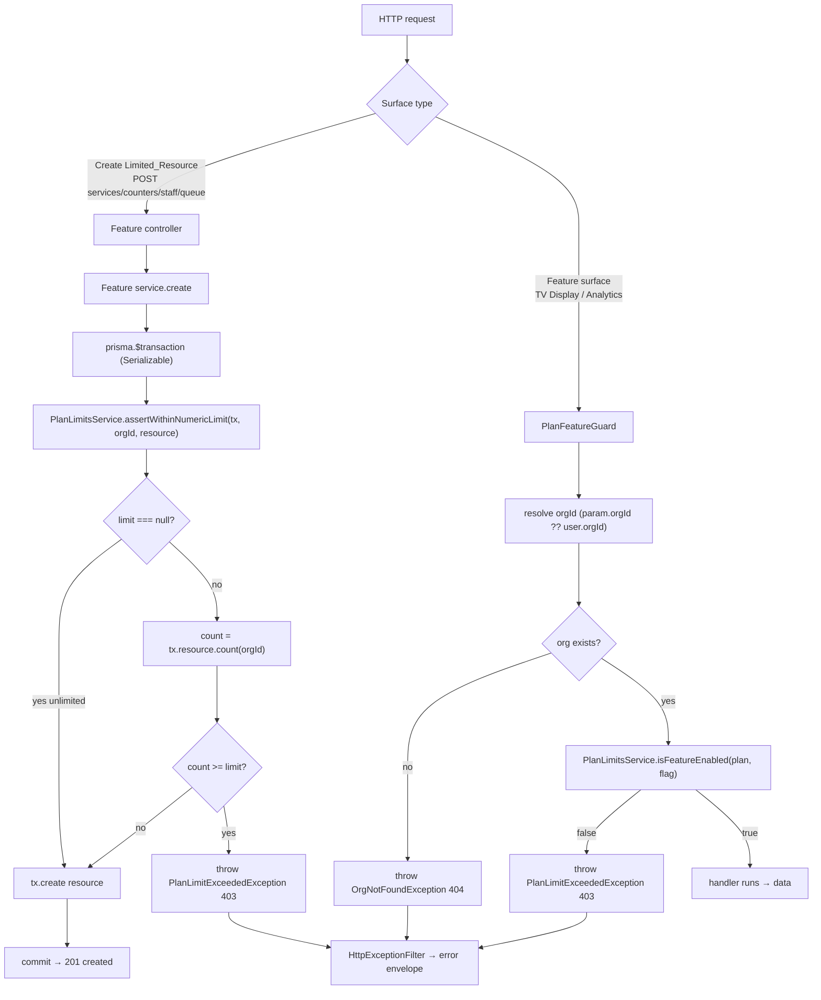
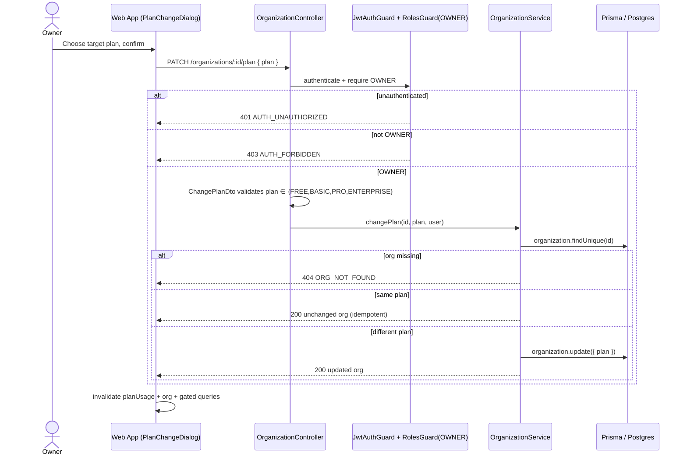

# Design Document

## Overview

This feature turns the dormant `PLAN_LIMITS` table (in `packages/shared-constants`) into an
enforced security boundary in the QueueNow API, and mirrors that enforcement in the web app.
Today nothing reads `PLAN_LIMITS`: a `FREE` org can create unlimited Services/Counters/Staff and
freely hit the TV Display board. This design adds:

- A central, reusable **`PlanLimitsService`** in `apps/api` that resolves an Organization's `plan`
  to its `PLAN_LIMITS` entry and exposes two enforcement primitives — an **atomic, transactional
  numeric-limit check** (for `maxServices`, `maxCounters`, `maxStaff`, `maxQueuePerDay`) and a
  **feature-flag check** (for `tvDisplay`, `analytics`).
- A new **`PLAN_LIMIT_EXCEEDED`** error code and a **`PlanLimitExceededException`** (HTTP 403)
  carrying structured `details`, flowing through the existing `HttpExceptionFilter` into the
  standard error envelope.
- A declarative **`PlanFeatureGuard` + `@RequiresFeature()` decorator** for feature-gating the
  public TV Display surface (by `orgId`) and the authenticated Analytics surface (by `user.orgId`).
- A **manual plan-change endpoint** `PATCH /organizations/:id/plan` (OWNER-only) as the interim
  upgrade path before Stripe billing.
- A **`GET /organizations/:id/plan-usage`** endpoint plus a TanStack Query hook and a **Plan &
  Usage** UI in org settings, an **upgrade-prompt** on `PLAN_LIMIT_EXCEEDED`, and **feature-gate
  mirroring** in the `AppShell` navigation.

The guiding principle (from the requirements and the steering RBAC convention) is: **the API is the
authoritative enforcement boundary; the web app only mirrors it.** Hiding a nav item is never
access control.

### Requirements coverage map

| Requirement                         | Where it is addressed                                                                                                                |
| ----------------------------------- | ------------------------------------------------------------------------------------------------------------------------------------ |
| R1 Numeric resource limits (atomic) | `PlanLimitsService.assertWithinNumericLimit` inside a Prisma transaction, called by `ServiceService`/`CounterService`/`StaffService` |
| R2 Daily queue volume               | `PlanLimitsService.assertWithinDailyQueueLimit` + org-timezone window helper, called by `QueueService.joinQueue`                     |
| R3 Feature-gate TV Display          | `PlanFeatureGuard` with `@RequiresFeature('tvDisplay')` on `DisplayController` (resolves `orgId` from route param)                   |
| R4 Feature-gate Analytics           | `PlanFeatureGuard` with `@RequiresFeature('analytics')` on the analytics surface (resolves `orgId` from JWT)                         |
| R5 Grandfather after downgrade      | Enforcement reads usage at create-time only; no plan-change side effects on existing rows                                            |
| R6 Manual plan-change endpoint      | `OrganizationController.changePlan` + `ChangePlanDto` + `RolesGuard('OWNER')`                                                        |
| R7 Consistent error response        | `PlanLimitExceededException` + `HttpExceptionFilter`                                                                                 |
| R8 Surface plan + usage             | `GET /organizations/:id/plan-usage` + `usePlanUsage` hook + `PlanUsageView`                                                          |
| R9 Mirror feature gates             | `featureFlag` on `AppShellNavItem` + `usePlanFeatures` gating                                                                        |
| R10 UAT/demo checklist              | `uat-checklist.md` in this spec directory                                                                                            |

## Architecture

### Backend enforcement decision

There are two distinct enforcement shapes, and they need different mechanisms:

1. **Numeric limits (R1, R2)** require an _atomic_ check-then-create: the usage count and the create
   must happen in one transaction so concurrent requests cannot both pass the check and overshoot
   the limit (R1.6). A NestJS Guard runs _before_ the route handler and _outside_ the create
   transaction, so it cannot provide this guarantee. Therefore numeric limits are enforced at the
   **service layer, inside a Prisma transaction**.
2. **Feature flags (R3, R4)** are a pure pre-handler authorization decision (is this surface allowed
   for this org's plan?) with no atomicity concern. This is a cross-cutting concern that applies
   identically to public and authenticated requests, so it is enforced with a declarative
   **Guard + decorator** — consistent with the existing `RolesGuard`/`@Roles` pattern.

| Option                         | Numeric limits                     | Feature flags                  |
| ------------------------------ | ---------------------------------- | ------------------------------ |
| Guard only                     | ✗ cannot be atomic with the create | ✓ chosen                       |
| Decorator only                 | ✗ no atomicity, no DB access       | ✗                              |
| Service-level (in transaction) | ✓ chosen                           | ✗ overkill, scatters the check |

Both paths delegate the _policy_ (plan → limits) to the single **`PlanLimitsService`** so there is
one source of truth and the controllers/services stay thin (Controller → Service pattern from
`project-standards.md`).

### Module layout (new `common/plan` building blocks)

```
apps/api/src/
├── common/
│   ├── exceptions/
│   │   ├── plan-limit-exceeded.exception.ts   ← new (HTTP 403, code PLAN_LIMIT_EXCEEDED)
│   │   └── org-not-found.exception.ts         ← new (HTTP 404, code ORG_NOT_FOUND)
│   ├── decorators/
│   │   └── requires-feature.decorator.ts      ← new (@RequiresFeature('tvDisplay' | 'analytics'))
│   └── guards/
│       └── plan-feature.guard.ts              ← new (reads org plan, enforces feature flag)
├── modules/
│   ├── plan/
│   │   ├── plan-limits.service.ts             ← new central policy/enforcement service
│   │   ├── plan-window.util.ts                ← new org-timezone daily-window helper
│   │   └── plan.module.ts                     ← new (exports PlanLimitsService, @Global)
│   ├── organization/   (PATCH :id/plan, GET :id/plan-usage added)
│   ├── service/        (create() wrapped in numeric-limit transaction)
│   ├── counter/        (create() wrapped in numeric-limit transaction)
│   ├── staff/          (invite()/add wrapped in numeric-limit transaction)
│   ├── queue/          (joinQueue() wrapped in daily-volume transaction)
│   └── display/        (@RequiresFeature('tvDisplay') on controller)
```

`PlanModule` is registered as `@Global()` (like Prisma) so any feature module can inject
`PlanLimitsService` without re-importing it.

### Enforcement flow (numeric limit + feature gate)



### Plan-change flow



## Components and Interfaces

### `PlanLimitsService` (central policy + enforcement)

The single source of truth that maps a plan to its `PLAN_LIMITS` entry and performs both kinds of
enforcement. It depends only on `PrismaService` and the static `PLAN_LIMITS`/`ERROR_CODES`
constants from `@queuenow/shared-constants`.

```ts
// Resource keys that map 1:1 to a numeric PLAN_LIMITS field.
export type NumericResource = 'services' | 'counters' | 'staff' | 'queuePerDay';
export type FeatureFlag = 'tvDisplay' | 'analytics' | 'customBranding';

export interface NumericLimitDetails {
  limitName: 'maxServices' | 'maxCounters' | 'maxStaff' | 'maxQueuePerDay';
  limit: number; // the numeric limit that was hit
  currentUsage: number; // usage measured at the moment of the attempt
  plan: PlanType; // R7.5 — always present
}

@Injectable()
export class PlanLimitsService {
  constructor(private readonly prisma: PrismaService) {}

  /** Resolve a plan to its limits object (pure). */
  limitsFor(plan: PlanType): (typeof PLAN_LIMITS)[PlanType];

  /** Pure feature decision used by the guard and the plan-usage endpoint. */
  isFeatureEnabled(plan: PlanType, flag: FeatureFlag): boolean;

  /**
   * Atomic numeric-limit guard for a create. MUST be called inside an existing
   * Prisma transaction `tx`. Throws PlanLimitExceededException when the limit
   * would be exceeded; returns void (caller proceeds with tx.create) otherwise.
   * `null` limit ⇒ unlimited ⇒ returns immediately (R1.4).
   */
  async assertWithinNumericLimit(
    tx: Prisma.TransactionClient,
    orgId: string,
    resource: NumericResource,
  ): Promise<void>;

  /** Daily-volume variant: counts created tickets in the org-timezone window (R2). */
  async assertWithinDailyQueueLimit(tx: Prisma.TransactionClient, orgId: string): Promise<void>;

  /** Build the plan-usage projection for the web app (R8). */
  async getPlanUsage(orgId: string): Promise<PlanUsageResponse>;
}
```

Usage counting per resource (measured at the moment of the attempt, R1.1):

| Resource      | Count query (within `tx`)                                                                                                                                |
| ------------- | -------------------------------------------------------------------------------------------------------------------------------------------------------- |
| `services`    | `tx.service.count({ where: { orgId } })`                                                                                                                 |
| `counters`    | `tx.counter.count({ where: { orgId } })`                                                                                                                 |
| `staff`       | `tx.userRole.count({ where: { orgId } })` (members) **plus** pending `invitation` count, so an invite that will become a member cannot bypass `maxStaff` |
| `queuePerDay` | daily-volume window count (see Data Models)                                                                                                              |

> Staff note: a `UserRole` row is the authoritative "member" record; `invite()` creates an
> `Invitation` first. To honor `maxStaff` at the moment of the attempt and avoid races, the staff
> count includes existing `UserRole` rows + `PENDING` invitations, and the invite is created inside
> the transaction. This keeps "seats consumed" honest.

### `assertWithinNumericLimit` reference logic

```ts
async assertWithinNumericLimit(tx, orgId, resource) {
  const org = await tx.organization.findUnique({ where: { id: orgId }, select: { plan: true } });
  if (!org) throw new OrgNotFoundException();
  const limits = this.limitsFor(org.plan);
  const { limitName, limit } = mapResourceToLimit(resource, limits); // e.g. 'maxServices' -> 1 | null
  if (limit === null) return;                       // R1.4 unlimited
  const currentUsage = await countUsage(tx, orgId, resource);
  if (currentUsage >= limit) {                       // R1.2 / R2.2 / R5.2
    throw new PlanLimitExceededException({ limitName, limit, currentUsage, plan: org.plan });
  }
  // R1.1 / R1.3: caller proceeds to tx.create within the same tx; usage unchanged on reject.
}
```

### Calling pattern in feature services (atomicity, R1.6)

Each create is wrapped so the count and the create are one atomic unit:

```ts
// ServiceService.create (same shape for Counter, Staff, Queue)
return this.prisma.$transaction(
  async (tx) => {
    await this.planLimits.assertWithinNumericLimit(tx, orgId, 'services');
    // existing uniqueness checks (e.g. prefix) run inside tx too
    return tx.service.create({ data: { orgId, ...dto } });
  },
  { isolationLevel: Prisma.TransactionIsolationLevel.Serializable },
);
```

**Concurrency / serialization considerations (R1.6):** `count` + `create` under
`Serializable` isolation makes two concurrent transactions that both read `usage = limit − 1`
mutually exclusive — Postgres detects the write-skew and aborts one with a serialization failure
(SQLSTATE `40001`), which surfaces as a retryable error. The losing request is retried once by a
small `runSerializable()` wrapper; on the retry it reads `usage = limit` and is rejected with
`PLAN_LIMIT_EXCEEDED`, so the resulting usage never exceeds the limit. An equivalent, lower-overhead
alternative is a Postgres **transaction-scoped advisory lock** keyed on `(orgId, resource)`
(`pg_advisory_xact_lock(hashtext($orgId || ':' || $resource))`) taken at the top of the transaction;
this serializes only same-org/same-resource creates and avoids cross-org contention. The design
uses `Serializable` for correctness with the advisory-lock approach documented as the optimization
if contention is observed.

### `PlanFeatureGuard` + `@RequiresFeature()` (feature gating, R3/R4)

```ts
export const REQUIRES_FEATURE_KEY = 'requiresFeature';
export const RequiresFeature = (flag: FeatureFlag) => SetMetadata(REQUIRES_FEATURE_KEY, flag);

@Injectable()
export class PlanFeatureGuard implements CanActivate {
  constructor(
    private reflector: Reflector,
    private planLimits: PlanLimitsService,
  ) {}

  async canActivate(ctx: ExecutionContext): Promise<boolean> {
    const flag = this.reflector.getAllAndOverride<FeatureFlag>(REQUIRES_FEATURE_KEY, [
      ctx.getHandler(),
      ctx.getClass(),
    ]);
    if (!flag) return true;

    const req = ctx.switchToHttp().getRequest();
    // R3.3: identical evaluation for public (param) and authenticated (JWT) requests.
    const orgId: string | undefined = req.params?.orgId ?? req.user?.orgId;
    if (!orgId) throw new OrgNotFoundException(); // no org context

    const org = await this.prisma.organization.findUnique({
      where: { id: orgId },
      select: { plan: true },
    });
    if (!org) throw new OrgNotFoundException(); // R3.4
    if (!this.planLimits.isFeatureEnabled(org.plan, flag)) {
      throw new PlanLimitExceededException({ flag, plan: org.plan }); // R3.1 / R4.1
    }
    return true;
  }
}
```

- **TV Display (R3):** `DisplayController` is `@Public()`. We add `@UseGuards(PlanFeatureGuard)` +
  `@RequiresFeature('tvDisplay')`. The guard resolves `orgId` from the `:orgId` route param, so it
  works without a JWT (R3.3). `ORG_NOT_FOUND` is returned for an unknown org (R3.4) and takes
  precedence over the feature check.
- **Analytics (R4):** the analytics surface sits behind `JwtAuthGuard` (so unauthenticated →
  `AUTH_UNAUTHORIZED`, R4.3) and then `PlanFeatureGuard` + `@RequiresFeature('analytics')`, which
  resolves `orgId` from `user.orgId`. No analytics module exists yet; the gate mechanism is defined
  here and attaches to the analytics controller when built. In the interim, the existing
  `GET /organizations/:id/stats` endpoint (today ungated dashboard stats) is the analytics surface
  and receives the same guard.

### Manual plan-change endpoint (R6)

Added to the existing `OrganizationController` (`@UseGuards(JwtAuthGuard, RolesGuard)`):

```ts
@Patch(':id/plan')
@Roles('OWNER')                                   // R6.2 non-OWNER → AUTH_FORBIDDEN; R6.3 anon → 401
@ApiOperation({ summary: "Change the organization's plan (OWNER only)" })
async changePlan(
  @Param('id') id: string,
  @Body() dto: ChangePlanDto,                     // R6.4 validates plan ∈ enum → VALIDATION_ERROR
  @CurrentUser() user: IAuthenticatedUser,
) {
  return this.organizationService.changePlan(id, dto.plan, user);
}
```

`OrganizationService.changePlan`:

- validates org-scope access (`user.orgId === id`), then `findUnique` → `OrgNotFoundException` if
  missing (R6.5);
- if `org.plan === dto.plan` returns the org unchanged without error (R6.6, idempotent);
- otherwise `organization.update({ where: { id }, data: { plan } })` and returns the updated org
  whose `plan` equals the target (R6.1);
- performs **no** side effects on existing Services/Counters/Staff/tickets — grandfathering (R5) is
  a consequence of enforcement reading usage only at create-time, so a downgrade never deletes,
  deactivates, or modifies existing rows (R5.1, R5.4). Subsequent enforcement decisions read the
  freshly persisted plan (R6.7).

### Plan-usage endpoint (R8 data source)

**Decision: add a dedicated `GET /organizations/:id/plan-usage` endpoint** rather than deriving
usage on the client. Justification: deriving would require the web app to (a) fetch every resource
list, (b) re-implement the `PLAN_LIMITS` lookup and the daily-window logic, and (c) keep that logic
in sync with the backend — duplicating the security-boundary policy on the client and risking drift.
A single server-computed projection is authoritative, mirrors enforcement exactly, is cheap (counts),
and is independently testable.

```ts
// GET /organizations/:id/plan-usage  (JwtAuthGuard + RolesGuard: OWNER, ADMIN)
export interface PlanUsageResource {
  resource: NumericResource;
  limitName: NumericLimitDetails['limitName'];
  usage: number;
  limit: number | null; // null ⇒ unlimited (R8.3)
  atLimit: boolean; // usage >= limit (false when unlimited) (R8.4)
}
export interface PlanUsageResponse {
  plan: PlanType; // R8.1
  features: Record<FeatureFlag, boolean>; // mirrors R9 gating
  resources: PlanUsageResource[]; // R8.2
}
```

### Custom exceptions (R7)

```ts
export class PlanLimitExceededException extends HttpException {
  constructor(details: NumericLimitDetails | { flag: FeatureFlag; plan: PlanType }) {
    super(
      {
        code: ERROR_CODES.PLAN_LIMIT_EXCEEDED, // new constant
        message: buildMessage(details), // non-empty (R7.2)
        details, // numeric: {limitName,limit,currentUsage,plan}
      }, // feature: {flag, plan} (R7.4)
      HttpStatus.FORBIDDEN, // 403 (R7.6)
    );
  }
}
```

The existing `HttpExceptionFilter` already reads `{ code, message, details }` off an
`HttpException`'s response object and emits the standard envelope, so no filter changes are needed —
the exception's `getStatus()` (403) becomes the HTTP status and `code`/`message`/`details` populate
`error` (R7.2–R7.6). `OrgNotFoundException` follows the same shape with `code: ORG_NOT_FOUND` /
HTTP 404.

### Frontend components

| Component / module                                                            | Responsibility                                                                                                         | Requirements    |
| ----------------------------------------------------------------------------- | ---------------------------------------------------------------------------------------------------------------------- | --------------- |
| `lib/api/query-keys.ts` → add `planUsage(orgId)`                              | central query key                                                                                                      | R8              |
| `features/organization/api/usePlanUsage.ts`                                   | `useQuery` for `GET :id/plan-usage`                                                                                    | R8.1–R8.3, R8.6 |
| `features/organization/api/useChangePlan.ts`                                  | `useMutation` `PATCH :id/plan`; invalidates `planUsage`, `org`, and gated lists                                        | R6, R8          |
| `features/organization/components/PlanUsageView.tsx`                          | renders plan name, `{usage} / {limit}` or `Unlimited`, per-resource upgrade prompt                                     | R8.1–R8.4, R8.6 |
| `features/organization/components/PlanChangeDialog.tsx`                       | OWNER-only target-plan picker → `useChangePlan`                                                                        | R6, R8.4, R9.4  |
| `features/auth/capabilities.ts` → `usePlanFeatures()`                         | resolve `{tvDisplay, analytics}` from `planUsage.features`                                                             | R9              |
| `features/auth/components/AppShell.tsx` → `featureFlag?` on `AppShellNavItem` | hide plan-only nav when flag false; OWNER sees upgrade entry                                                           | R9.1–R9.4       |
| `lib/api/error-map.ts` + `i18n/en.ts`                                         | map `PLAN_LIMIT_EXCEEDED` to friendly copy                                                                             | R8.5            |
| shared `onPlanLimitError` helper                                              | on `ApiError.code === 'PLAN_LIMIT_EXCEEDED'`, show upgrade prompt and **do not reset the form** (retain unsaved input) | R8.5            |

**Upgrade-prompt on rejection (R8.5):** feature mutation hooks (`useCreateService`, etc.) already
throw a typed `ApiError`. Their `onError`/calling form inspects `error.code`; when it is
`PLAN_LIMIT_EXCEEDED`, the form shows the upgrade prompt (a toast/inline CTA opening
`PlanChangeDialog`) and leaves the form state untouched so the user's input is preserved.

**Feature-gate mirroring (R9):** `AppShellNavItem` gains an optional `featureFlag?: FeatureFlag`.
The shell's `visibleNavItems` filter keeps an item only when (capability satisfied) **and**
(no `featureFlag`, or `usePlanFeatures()[featureFlag]` is true). When a `featureFlag` item is hidden
and the active role is OWNER, the shell renders an **upgrade entry** in its place pointing at the
Plan & Usage section (R9.4). This is presentation only; the API remains the boundary (R9.5).

## Data Models

No schema migration is required for enforcement itself — all inputs already exist:

- `Organization.plan: PlanType` (`@default(FREE)`) — the plan under enforcement.
- `Organization.timezone: String` (`@default("Asia/Kuala_Lumpur")`) — the daily-window timezone.
- `QueueSettings.resetTime: String` (`@default("00:00")`) — the daily-window start. (Note: the
  requirements glossary refers to `resetTime` on the Organization; in the actual schema it lives on
  the related `QueueSettings` record. The window helper reads it from there, defaulting to
  `QUEUE_DEFAULTS.RESET_TIME` when settings are absent.)
- `Service` / `Counter` / `UserRole` / `Invitation` / `QueueTicket` — counted for `Current_Usage`.
- `DailyQueueCounter.lastNumber` — a per-service/day **monotonic created-count** (incremented on
  every join, never decremented; skip/complete only touch `totalSkipped`/`totalServed`).

### New shared constant (R7.1)

`packages/shared-constants/src/index.ts` → add to `ERROR_CODES`:

```ts
// Plan
PLAN_LIMIT_EXCEEDED: 'PLAN_LIMIT_EXCEEDED',
```

### Daily-queue-volume window + counting (R2)

`Daily_Queue_Volume` is the number of tickets **created** for the org in the current window
(R2.5: counted regardless of later cancellation/completion/deletion). Two facts make this robust:

1. Tickets are never hard-deleted in normal flow — cancel/skip/complete are status transitions, and
   `createdAt` persists. So counting `QueueTicket` rows by `createdAt` within the window already
   counts created tickets regardless of later status changes.
2. For defense against rare hard-deletes, `DailyQueueCounter.lastNumber` is a monotonic created
   count that survives row deletion.

**Chosen measure:** the **authoritative count is the sum of `DailyQueueCounter.lastNumber`** across
the org's services for the current window date, because it is monotonic and deletion-proof (fully
satisfies R2.5). The window date is computed in the org timezone:

```ts
// plan-window.util.ts (pure, unit + property tested)
export interface DailyWindow {
  start: Date;
  end: Date;
  windowDate: Date;
}

/** Compute [start,end) of the current daily window in the org timezone (R2.4). */
export function resolveDailyWindow(timezone: string, resetTime: string, now: Date): DailyWindow;
```

`assertWithinDailyQueueLimit` resolves the window, sums the created-count for `windowDate`, and
applies the same `>=` rejection rule as numeric limits. `null` `maxQueuePerDay` ⇒ unlimited (R2.3).
The increment of the daily counter and the ticket create stay inside `joinQueue`'s transaction so
the volume check and create are atomic.

> Related cleanup (flagged, not strictly required): the existing per-service `maxQueuePerDay` check
> and the `DailyQueueCounter.date` key currently use **server-local midnight** rather than the org
> timezone. Aligning both to `resolveDailyWindow` keeps the plan-level and per-service windows
> consistent.

## Correctness Properties

_A property is a characteristic or behavior that should hold true across all valid executions of a
system — essentially, a formal statement about what the system should do. Properties serve as the
bridge between human-readable specifications and machine-verifiable correctness guarantees._

This feature is well suited to property-based testing because the enforcement core is pure,
input-driven logic (resolve plan → limits, compare usage to limit, resolve the daily window, decide
a feature flag, project usage, format usage, decide nav visibility) plus a small stateful model
(usage across a sequence of creates/deletes). These are tested against an in-memory model so 100+
iterations are cheap; real database atomicity and RBAC/auth error paths are verified with focused
integration/example tests (see Testing Strategy).

The properties below were derived from the prework analysis and consolidated to remove redundancy
(the many numeric-limit criteria across R1/R2/R5 collapse into one decision property plus one
stateful safety invariant; the error-shape criteria R7.2–R7.6 collapse into two variant properties).

### Property 1: Numeric-limit decision is allow-iff-below-limit

_For any_ plan, any Limited_Resource (`services`, `counters`, `staff`, `queuePerDay`), and any
non-negative `currentUsage`, the enforcement decision is ALLOW when the resolved numeric limit is
`null` (unlimited) or `currentUsage < limit`, and is REJECT with error code `PLAN_LIMIT_EXCEEDED`
when the resolved limit is a number and `currentUsage >= limit`.

**Validates: Requirements 1.1, 1.2, 1.4, 1.5, 2.1, 2.2, 2.3, 5.2, 5.6**

### Property 2: Usage never exceeds the limit and rejects leave usage unchanged

_For any_ initial usage and _any_ sequence (including concurrent interleavings) of create attempts
and deletions applied to the enforcement model for a fixed plan and resource, the committed usage
never exceeds the numeric limit, every rejected attempt returns `PLAN_LIMIT_EXCEEDED` and leaves
usage unchanged, and any deletion that brings usage below the limit makes the next create attempt
ALLOW.

**Validates: Requirements 1.3, 1.6, 5.6**

### Property 3: Daily-volume window is the org-timezone reset-time day

_For any_ timezone, any `resetTime` (`HH:MM`), and any instant `now`, `resolveDailyWindow` returns a
half-open interval `[start, end)` such that `start <= now < end`, the interval spans exactly one
calendar day in that timezone (DST-aware), and `start`'s wall-clock time in the org timezone equals
`resetTime`.

**Validates: Requirements 2.4**

### Property 4: Daily volume counts creations regardless of later state changes

_For any_ sequence of ticket creations within a window followed by _any_ later cancellations,
completions, or deletions of those tickets, the measured Daily_Queue_Volume equals the number of
tickets created within that window.

**Validates: Requirements 2.5**

### Property 5: Feature gate permits iff the plan enables the flag, independent of auth source

_For any_ plan and _any_ Feature_Flag (`tvDisplay`, `analytics`), the feature gate permits access if
and only if that plan's flag is `true`, and the decision depends only on the resolved organization's
plan — it is identical whether the `orgId` is resolved from a public route parameter or from an
authenticated user.

**Validates: Requirements 3.1, 3.2, 3.3, 4.1, 4.2**

### Property 6: A plan change never mutates existing resources or configuration

_For any_ organization state (its Services, Counters, Staff, tickets, branding, and queue settings)
and _any_ target plan, applying the plan change leaves every existing resource and configuration
record present and unmodified — the only field that changes is the organization's `plan`.

**Validates: Requirements 5.1, 5.4**

### Property 7: Disabling then re-enabling a feature preserves config and restores access

_For any_ surface configuration, changing to a plan whose Feature_Flag is `false` and then to a plan
whose Feature_Flag is `true` leaves the configuration identical and results in access being
permitted (a round-trip with no data loss).

**Validates: Requirements 5.5**

### Property 8: Plan change sets the target, is idempotent, and governs later decisions

_For any_ current plan and _any_ valid target plan, the plan change yields an organization whose
`plan` equals the target; when the target equals the current plan the organization is returned
unchanged without error; applying the same change twice produces the same result as applying it once
(idempotence); and every enforcement decision evaluated after the change uses the target plan's
limits.

**Validates: Requirements 6.1, 6.6, 6.7**

### Property 9: PLAN_LIMIT_EXCEEDED error envelope shape

_For any_ plan-limit rejection, the resulting error envelope has `success === false`,
`error.code === 'PLAN_LIMIT_EXCEEDED'`, a non-empty `error.message`, the organization's current plan
name in `error.details`, and HTTP status 403; _for any_ numeric rejection `error.details`
additionally contains the exceeded `limitName`, the `limit` as a number, and the `currentUsage` as a
number; _for any_ feature-flag rejection `error.details` contains the `flag` name and omits `limit`
and `currentUsage`.

**Validates: Requirements 7.2, 7.3, 7.4, 7.5, 7.6**

### Property 10: Usage formatting renders the limit or "Unlimited"

_For any_ non-negative usage and limit, the usage formatter returns exactly `"{usage} / {limit}"`
when the limit is a number and exactly `"Unlimited"` when the limit is `null`.

**Validates: Requirements 8.2, 8.3**

### Property 11: Upgrade prompts appear exactly for at-limit resources

_For any_ plan-usage projection, the set of resources for which the Plan & Usage view shows an
upgrade prompt equals the set of resources whose limit is a number and whose usage is greater than
or equal to that limit.

**Validates: Requirements 8.4**

### Property 12: Upgrade prompt is triggered exactly by PLAN_LIMIT_EXCEEDED

_For any_ API error, the upgrade-prompt classifier returns `true` if and only if the error's `code`
is `PLAN_LIMIT_EXCEEDED`.

**Validates: Requirements 8.5**

### Property 13: Navigation visibility mirrors capability and plan feature flags

_For any_ active role and _any_ set of plan feature flags, a plan-only navigation item is visible if
and only if the role satisfies the item's capability and the item's feature flag is enabled; and an
upgrade entry is shown in place of a gated surface if and only if the active role is OWNER and that
surface's feature flag is disabled.

**Validates: Requirements 9.1, 9.2, 9.3, 9.4**

## Error Handling

All errors flow through the existing `HttpExceptionFilter`, which reads `{ code, message, details }`
from an `HttpException`'s response object and emits the standard envelope
`{ success: false, error: { code, message, details }, meta }`. No filter changes are required.

| Condition                                             | Exception                                      | HTTP | `error.code`          |
| ----------------------------------------------------- | ---------------------------------------------- | ---- | --------------------- |
| Numeric limit reached on create (R1.2, R2.2, R5.2)    | `PlanLimitExceededException` (numeric details) | 403  | `PLAN_LIMIT_EXCEEDED` |
| Disabled feature flag accessed (R3.1, R4.1)           | `PlanLimitExceededException` (feature details) | 403  | `PLAN_LIMIT_EXCEEDED` |
| TV Display / plan-change for unknown org (R3.4, R6.5) | `OrgNotFoundException`                         | 404  | `ORG_NOT_FOUND`       |
| Plan change by non-OWNER (R6.2)                       | `ForbiddenException` via `RolesGuard`          | 403  | `AUTH_FORBIDDEN`      |
| Unauthenticated plan change / analytics (R4.3, R6.3)  | `UnauthorizedException` via `JwtAuthGuard`     | 401  | `AUTH_UNAUTHORIZED`   |
| Invalid target plan value (R6.4)                      | validation error (`ChangePlanDto`)             | 400  | `VALIDATION_ERROR`    |

Ordering guarantees:

- For feature-gated public surfaces, `ORG_NOT_FOUND` (unknown org) is decided **before** the feature
  check, so a bad `orgId` never leaks plan information (R3.4).
- For authenticated surfaces, `JwtAuthGuard` (401) runs before `RolesGuard` (403) before
  `PlanFeatureGuard` (403), so authentication failures take precedence (R4.3, R6.3).
- A rejected create throws inside the Prisma transaction, which rolls back, guaranteeing usage is
  unchanged on rejection (R1.3, R2 reject paths, R5.2).

Logging: rejections are logged with `{ orgId, plan, resource|flag, currentUsage, limit }` context
(no PII), consistent with `project-standards.md` "Log errors with context". User-facing messages are
safe (no internal details), and the web app maps `error.code` to curated copy via
`lib/api/error-map.ts` — never surfacing raw backend messages.

## Testing Strategy

### Property-based tests (the 13 properties above)

- **Library:** `fast-check` — already the repo's PBT library (Vitest on the frontend; `fast-check`
  with Jest on the backend). Do not hand-roll property testing.
- **Iterations:** minimum 100 runs per property (`fc.assert(fc.property(...), { numRuns: 100 })` or
  higher).
- **Tagging:** each property test is tagged with a comment in the repo's existing format:
  `// Feature: plan-limit-enforcement, Property {n}: {property text}`.
- **Backend (Jest + fast-check):**
  - Properties 1, 2, 5, 6, 7, 8 are tested against an **in-memory enforcement model** (a pure
    reimplementation of the decision/usage logic), keeping runs fast and isolated from the DB.
    Property 2 is **model-based / stateful** (`fc.commands` or a sequence generator) to cover
    interleavings and the never-exceeds invariant.
  - Property 3 (`resolveDailyWindow`) is tested against an independent timezone-pinned oracle
    (mirroring the existing `format.property.test.ts` approach for `Intl` time zones), including DST
    boundaries.
  - Property 4 generates create-then-mutate/delete sequences and asserts the counted volume equals
    the number of in-window creates.
  - Property 9 generates numeric and feature `details` and asserts the produced envelope shape and
    403 status through the real `PlanLimitExceededException` + `HttpExceptionFilter`.
- **Frontend (Vitest + fast-check):** Properties 10, 11, 12, 13 test the pure formatter, the
  at-limit projection, the upgrade-prompt classifier, and the `AppShell` visibility/upgrade-entry
  predicate respectively.

### Unit / example tests (specific scenarios and error paths)

- `ORG_NOT_FOUND` for unknown `orgId` on TV Display and plan change (R3.4, R6.5).
- `AUTH_UNAUTHORIZED` for anonymous analytics and plan-change requests (R4.3, R6.3).
- `AUTH_FORBIDDEN` for ADMIN/STAFF plan-change attempts; org plan unchanged (R6.2).
- `VALIDATION_ERROR` for non-enum target plan values via `ChangePlanDto` (R6.4) — an edge-case set
  of invalid strings.
- Over-limit existing resources remain readable/updatable (R5.3).
- `ERROR_CODES.PLAN_LIMIT_EXCEEDED` constant presence (R7.1) — smoke assertion.
- `PlanUsageView`: renders the plan name (R8.1) and shows an error indication with no usage values
  when the query fails (R8.6); a create form retains its input when a `PLAN_LIMIT_EXCEEDED` error is
  returned (R8.5 behavior).

### Integration tests (real database, true atomicity — R1.6)

- A concurrency test issues N parallel create requests for the same resource of the same org while
  `currentUsage = limit − 1`, against a real Postgres transaction at `Serializable` isolation, and
  asserts the final committed count equals `limit` and the excess requests received
  `PLAN_LIMIT_EXCEEDED` (HTTP 403). This validates the real transactional guarantee that the
  in-memory model (Property 2) asserts logically.
- A direct-API over-limit create (no UI) returns the `PLAN_LIMIT_EXCEEDED` envelope with status 403
  (R10.7), exercised via Supertest.

### UAT / demo checklist (R10)

The UAT/demo checklist lives at **`.kiro/specs/plan-limit-enforcement/uat-checklist.md`** (authored
during implementation, in this spec directory alongside `requirements.md` and `design.md`). It
enumerates the manual verification steps mandated by R10.1–R10.7: per-resource allow-then-reject,
`null` ⇒ unlimited / "Unlimited" display, upgrade-then-create-up-to-new-limit, TV Display and
Analytics gating on/off, downgrade grandfathering + reject + re-permit after deletion, and a direct
API call (without the web app) confirming the `PLAN_LIMIT_EXCEEDED` / HTTP 403 response.
