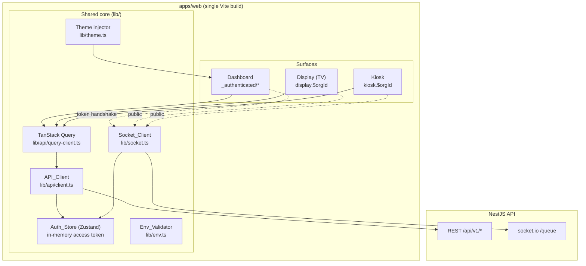
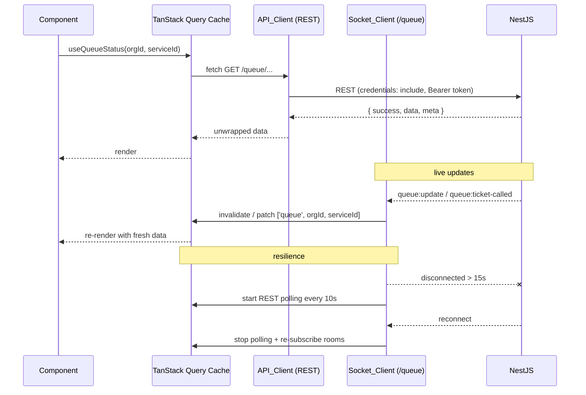
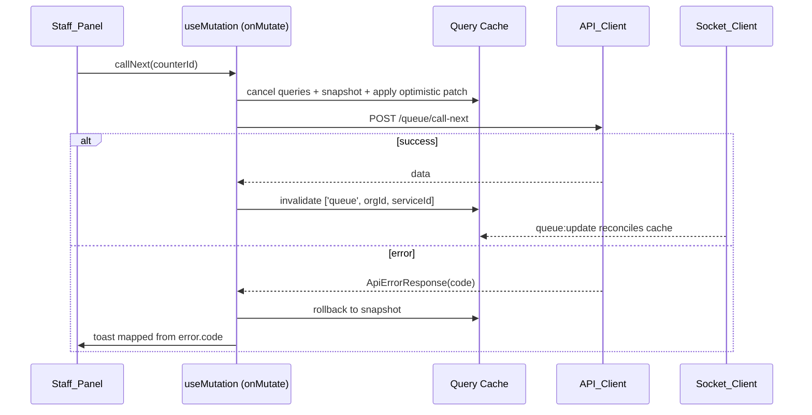
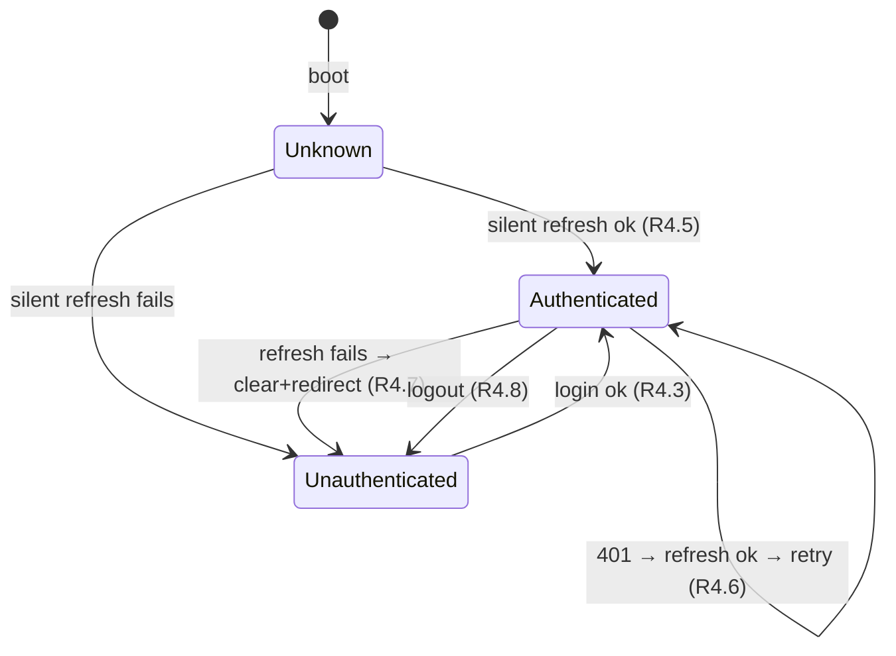
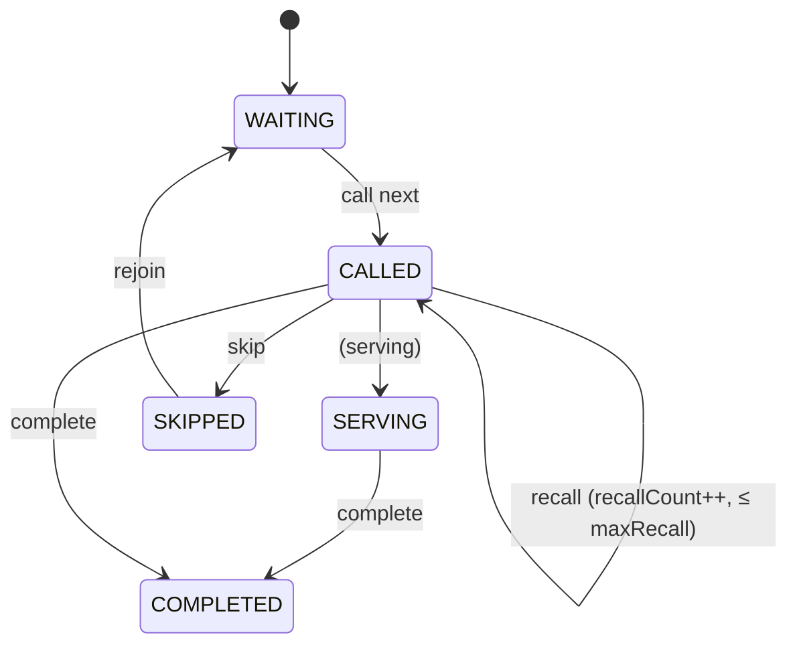

# Design Document

## Overview

This document describes the design of the QueueNow React web frontend (`apps/web`) — the staff/admin and public-screen application for the multi-tenant SaaS Queue Management System. The NestJS API is the sole source of data; the frontend talks to it over REST (HTTP) and realtime (socket.io, namespace `/queue`). All choices here implement the requirements in `requirements.md` and conform to `.kiro/steering/frontend-web.md` (authoritative) and `.kiro/steering/project-standards.md`.

The app is a single Vite build hosting three surfaces:

| Surface      | Path                                  | Auth              | Audience                          |
| ------------ | ------------------------------------- | ----------------- | --------------------------------- |
| Dashboard    | `/` and nested under `_authenticated` | Required (JWT)    | OWNER / ADMIN / STAFF             |
| Display (TV) | `/display/:orgId`                     | Public, read-only | Walk-in customers                 |
| Kiosk        | `/kiosk/:orgId`                       | Public            | On-site customers taking a ticket |

The design is deliberately layered so that the cross-cutting concerns — the typed API client, the socket client, the auth/session lifecycle, query-key conventions, theming, and the error/loading/empty-state strategy — are built once in `lib/` and reused by every feature. Feature modules stay thin and domain-focused.

Delivery is phased to match the requirements:

- **Phase 1 (MVP):** foundation/scaffolding (R1), API client (R2), realtime client (R3), auth/session (R4), guards & RBAC (R5), staff queue-serving panel (R6), public Display (R7).
- **Phase 2:** services (R8), counters (R9), staff management (R10).
- **Phase 3:** organization settings & branding/theming (R11), public Kiosk (R12).
- **Cross-cutting (all phases):** accessibility (R13), i18n readiness (R14), testing & quality gates (R15).

The phasing affects sequencing and what lands in the initial bundle, but the architecture below is established in Phase 1 so later phases only add feature modules.

## Architecture

### High-level surfaces and shared core



All three surfaces share the component library, design tokens, the API client, and the socket client. The customer mobile experience is out of scope — it lives in `apps/mobile`.

### Layering

The app is organized in four layers, top to bottom:

1. **Routes (`routes/`)** — thin file-based TanStack Router modules. They parse params/search, run `beforeLoad` guards, and render a feature component. No data logic.
2. **Features (`features/<domain>/`)** — domain UI plus colocated TanStack Query hooks (`api/`), domain hooks (`hooks/`), components, and (rarely) a small Zustand store for ephemeral UI state.
3. **Core libraries (`lib/`)** — the API client, query client, socket client, env validator, theme injector, and formatting utilities. This is where every cross-cutting requirement is implemented once.
4. **Shared UI (`components/ui/`, `components/`)** — shadcn primitives and domain-agnostic shared components.

A feature never imports another feature's internals; sharing happens via `components/`, `hooks/`, or `lib/`. (Requirement 1.2, steering "Folder Structure".)

### Data flow: REST + WebSocket → TanStack Query → UI

The central architectural decision (steering "Realtime", R3.6) is that **TanStack Query is the single source of truth for server state**. REST populates the cache; the socket does not own a parallel store — it invalidates or patches the same query keys. UI reads only from the query cache.



This bridge pattern means the queue UI behaves identically whether an update arrives by socket push or by REST poll — both end as cache writes. (R3.6, R3.8, R3.9, R7.9.)

### Mutation + optimistic update flow (staff actions)



(R6.10, R6.11, steering "Optimistic updates".)

## Components and Interfaces

### Folder / module structure

Implements Requirement 1.2 and the steering "Folder Structure" exactly:

```
apps/web/
├── .env.example                 # R1.6 — every required var
├── package.json                 # scripts incl. generate:api (R1.7)
├── vite.config.ts
├── tailwind.config.ts
├── index.html
└── src/
    ├── main.tsx                 # boot: env validate → silent refresh → render
    ├── router.tsx               # TanStack Router instance + types
    ├── routes/
    │   ├── __root.tsx
    │   ├── index.tsx
    │   ├── login.tsx
    │   ├── register.tsx
    │   ├── _authenticated.tsx        # layout route + auth beforeLoad (R5.1)
    │   ├── _authenticated/
    │   │   ├── dashboard.tsx
    │   │   ├── queue.tsx
    │   │   ├── services.tsx           # Phase 2, role beforeLoad
    │   │   ├── counters.tsx           # Phase 2
    │   │   ├── staff.tsx              # Phase 2
    │   │   └── settings.tsx           # Phase 3
    │   ├── display.$orgId.tsx        # Phase 1, lazy (R1.8)
    │   └── kiosk.$orgId.tsx          # Phase 3, lazy (R1.8)
    ├── features/
    │   ├── auth/        # stores/ (Auth_Store), api/, hooks/ (useAuth,useHasRole), components/, RoleGate
    │   ├── queue/       # Staff_Panel, api/ (useQueueStatus,useCallNext,...), hooks/
    │   ├── display/     # board, audio announcer, sound-unlock overlay
    │   ├── services/    # Phase 2
    │   ├── counters/    # Phase 2
    │   ├── staff/       # Phase 2
    │   ├── organization/# Phase 3 (settings, branding)
    │   └── kiosk/       # Phase 3
    ├── components/
    │   ├── ui/          # shadcn generated
    │   ├── ConnectionIndicator.tsx   # reconnecting banner (R3.11)
    │   ├── DataRegion.tsx            # loading/empty/error wrapper
    │   └── ErrorBoundary.tsx
    ├── lib/
    │   ├── api/{schema.d.ts, client.ts, query-client.ts, error-map.ts, query-keys.ts}
    │   ├── socket.ts
    │   ├── theme.ts
    │   ├── env.ts
    │   ├── format.ts                 # org-timezone formatting (R7.10, R14.3)
    │   └── utils.ts                  # cn()
    ├── hooks/           # cross-feature hooks (useSocketSubscription, usePollingFallback)
    ├── i18n/            # centralized strings (R14.2)
    └── types/           # app-local types
```

### Environment validation (`lib/env.ts`) — R1.3–R1.6

A Zod schema validates `import.meta.env` on boot and exports a typed, frozen `env` object. All config access goes through it; nothing reads `import.meta.env` directly elsewhere, and `process.env` is never referenced in client code.

```ts
const envSchema = z.object({
  VITE_API_URL: z.string().url(),
  VITE_WS_URL: z.string().url(),
});

// Parse import.meta.env. On failure, throw an Error naming the missing/invalid
// var; main.tsx catches and renders a full-screen fatal-config message instead
// of mounting the app (fail-fast — R1.4).
export const env = parseEnvOrThrow();
```

`main.tsx` calls validation before anything else, so a misconfigured deploy halts with a named error rather than failing deep in a request. (R1.3, R1.4, R1.5.) `.env.example` lists `VITE_API_URL` and `VITE_WS_URL` (R1.6).

### API client (`lib/api/client.ts`) — R2, R4.5, R4.6

The API_Client is the single REST entry point. Feature code never calls `fetch` directly; it uses TanStack Query hooks in each feature's `api/` folder (R2.1).

Responsibilities:

- **Base URL** from `env.VITE_API_URL`.
- **`credentials: 'include'`** on every request so the httpOnly refresh cookie is sent (R2.2).
- **Authorization header**: attaches `Bearer <accessToken>` read from the Auth_Store when a token is present (R2.3).
- **Envelope unwrapping**: on a success envelope `{ success: true, data, meta }`, returns `data` to the caller; for paginated responses it also exposes `meta` (page/limit/total). (R2.4, R2.5.)
- **Error surfacing**: on `{ success: false, error }`, throws a typed `ApiError` carrying `error.code`, `error.message`, and `error.details` so callers/hooks can map the code to copy and field errors (R2.6, R4.10).
- **401 refresh-and-retry**: on a `401`, performs a single `POST /auth/refresh`, updates the in-memory token, and retries the original request exactly once. Concurrent 401s share one in-flight refresh (a single promise) so only one refresh occurs. If refresh fails, it clears the Auth_Store and signals a redirect to login (R4.6, R4.7).

```ts
export class ApiError extends Error {
  constructor(
    public code: string,
    message: string,
    public details?: Record<string, unknown>,
    public httpStatus?: number,
  ) {
    super(message);
  }
}

// request<TData>(path, init): Promise<{ data: TData; meta?: Meta }>
//   1. build URL + headers (Bearer if token), credentials: 'include'
//   2. fetch; if 401 and not already retried → refreshOnce() then retry once
//   3. parse envelope: success → return {data, meta}; error → throw ApiError(code)
```

Request/response types are derived from the generated `lib/api/schema.d.ts` (`openapi-typescript`), with `@queuenow/shared-types` for shared enums/interfaces (R2.7). The `generate:api` script regenerates the schema from the backend Swagger doc (R1.7); the file is treated as generated and never hand-edited.

> Note on the login response: `ILoginResponse.tokens` contains both `accessToken` and `refreshToken`. The frontend uses **only** `accessToken` (kept in memory); the `refreshToken` in the body is ignored because the backend also sets it as the httpOnly cookie that drives refresh. This keeps Requirement 4.4 satisfiable.

### Query client + keys (`lib/api/query-client.ts`, `lib/api/query-keys.ts`) — R2, steering "API Layer"

A single `QueryClient` is configured with sensible defaults (retry off for 4xx, a default `staleTime`, and an error handler that maps `ApiError.code`). Query keys are arrays namespaced by feature with a central factory so invalidation is consistent:

```ts
export const queryKeys = {
  queue: (orgId: string, serviceId?: string) => ['queue', orgId, serviceId] as const,
  services: (orgId: string) => ['services', orgId] as const,
  counters: (orgId: string) => ['counters', orgId] as const,
  staff: (orgId: string, page: number) => ['staff', orgId, page] as const,
  org: (orgId: string) => ['organization', orgId] as const,
};
```

Mutations invalidate the relevant key(s) on success; manual cache writes are reserved for optimistic updates (R3.6, R6.10, R8.5, R9.5, R10.4).

### Socket client (`lib/socket.ts`) — R3

One `socket.io-client` connection per app session on the `/queue` namespace (R3.1). It is created lazily and exposes a small surface used by a shared subscription hook.

- **Dashboard handshake** includes the in-memory access token: `io(env.VITE_WS_URL + '/queue', { auth: { token } })` (R3.2). When the Auth_Store token changes (after refresh), the socket reconnects with the new token (R3.3).
- **Display/Kiosk** connect with no token and only `subscribe` to public `orgId` rooms; they never emit authenticated actions (R3.4).
- **Subscription** uses `WS_EVENTS` from `@queuenow/shared-constants` (`subscribe`, `unsubscribe`, `subscribe:ticket`). A shared `useSocketSubscription({ orgId, serviceId })` hook emits `subscribe` on mount and `unsubscribe` + listener-removal on unmount (R3.5, R3.10).
- **Event bridge**: handlers for `queue:update` and `queue:ticket-called` invalidate or patch the matching query keys via the shared QueryClient (R3.6).
- **Reconnect**: socket.io auto-reconnect with backoff is enabled. On every `reconnect`, the client re-emits `subscribe` for all currently-tracked rooms (R3.7). A subscription registry (a `Set` of room descriptors held in the socket module) makes re-subscription deterministic.
- **Reconnecting indicator**: connection status is exposed (e.g. a tiny Zustand slice or a React context) and surfaced via `<ConnectionIndicator>` as a non-blocking banner (R3.11).

### Polling fallback (`hooks/usePollingFallback.ts`) — R3.8, R3.9, R7.9

A shared hook watches socket connection status. When disconnected for more than 15 seconds, it begins invalidating the relevant queue query keys every 10 seconds (REST poll). When the socket reconnects, it stops polling. Because polling is implemented as query invalidation, it reuses the exact same REST path and cache as normal loads — no separate code path for "degraded" mode. This serves both the Staff_Panel and the always-on Display.

### Auth & session (`features/auth/`) — R4, R5

**Auth_Store (Zustand)** holds only in-memory state:

```ts
interface AuthState {
  accessToken: string | null; // memory only — never persisted (R4.4)
  user: ILoginResponse['user'] | null;
  organization: ILoginResponse['organization'] | null; // includes role
  status: 'unknown' | 'authenticated' | 'unauthenticated';
  setSession(r: ILoginResponse): void; // stores token + user + org/role (R4.3)
  setAccessToken(t: string): void; // used by refresh
  clear(): void; // logout / failed refresh (R4.7, R4.8)
}
```

The store is **not** wrapped in any persistence middleware, and the token is never written to `localStorage`, `sessionStorage`, or a non-httpOnly cookie (R4.4).

**Boot sequence (`main.tsx`)**: after env validation, attempt a single silent `POST /auth/refresh`. On success, populate the Auth_Store (`status: 'authenticated'`); on failure, set `status: 'unauthenticated'`. Only then render the router. This restores sessions across hard reloads where the in-memory token is gone but the refresh cookie persists (R4.5).

**Forms** use TanStack Form (`@tanstack/react-form`) with the shared schemas `loginSchema` / `registerSchema` from `@queuenow/shared-validation` as Standard Schema validators (R4.1, R4.2). Submit is disabled while the submission is in flight via `state.isSubmitting` (R4.9). Backend `error.details` are mapped onto the corresponding fields by returning `{ fields }` from the form's `onSubmitAsync` validator (R4.10).

**Logout** calls `POST /auth/logout`, clears the Auth_Store, and redirects to `/login` (R4.8).



### Routing, guards, and role-based UI — R5

**Route guards** run in TanStack Router `beforeLoad`:

- The `_authenticated` layout route checks `Auth_Store.status`; if not authenticated it throws a `redirect` to `/login` (R5.1).
- Role-restricted routes (services/counters/staff/settings) add a role check in their `beforeLoad`. If the active role lacks the capability, they `redirect` to `/dashboard` and queue a toast explaining the restriction (R5.4). Guards read the role from the Auth_Store, which is hydrated before the router renders.

**Role-based UI** is provided by `features/auth`:

- `useHasRole(...roles: UserRoleType[]): boolean` — true when the active role is in the set.
- `<RoleGate roles={[...]}>children</RoleGate>` — renders children only when permitted (R5.2).

The capability matrix (steering) is encoded once as a lookup so nav items and action controls hide consistently (R5.3):

| Capability                              | OWNER | ADMIN | STAFF |
| --------------------------------------- | :---: | :---: | :---: |
| Serve queue (call/recall/skip/complete) |   ✓   |   ✓   |   ✓   |
| Services / Counters CRUD                |   ✓   |   ✓   |   –   |
| Staff management                        |   ✓   |   ✓   |   –   |
| Org settings / branding                 |   ✓   |   ✓   |   –   |
| Billing / plan                          |   ✓   |   –   |   –   |
| Delete organization                     |   ✓   |   –   |   –   |

This matrix backs R5.5 (queue serving for all three roles), R5.6 (services/counters/staff/settings for OWNER+ADMIN), and R5.7 (billing/org-deletion for OWNER only). UI hiding is never the security boundary — the backend authorizes every request — but the UI must not present actions a role cannot perform.

### Staff queue-serving panel (`features/queue/`) — R6

The Staff_Panel composes:

- **Counter selector** — pick an active counter before serving (R6.2); selection is ephemeral UI state in a small Zustand slice.
- **Queue state view** — per-service waiting count, currently called tickets, and the ticket this staff member is serving (R6.1), read from `useQueueStatus(orgId, serviceId)`.
- **Action controls** — call next, recall, skip, complete, rejoin, each a mutation hook:

| Action    | Hook                | Endpoint intent            | Notes                                                                               |
| --------- | ------------------- | -------------------------- | ----------------------------------------------------------------------------------- |
| Call next | `useCallNextTicket` | call-next with `counterId` | reflects new CALLED ticket (R6.3); empty-queue message on `QUEUE_NO_WAITING` (R6.4) |
| Recall    | `useRecallTicket`   | recall                     | reflects recall count (R6.5); on `QUEUE_MAX_RECALL` advise skip (R6.6)              |
| Skip      | `useSkipTicket`     | skip                       | removes from active serving list (R6.7)                                             |
| Complete  | `useCompleteTicket` | complete                   | marks COMPLETED (R6.8)                                                              |
| Rejoin    | `useRejoinTicket`   | rejoin                     | returns SKIPPED ticket to WAITING (R6.9)                                            |

Call-next/recall/skip/complete apply **optimistic updates** with `onMutate` (snapshot + patch), reconcile via query invalidation on success, and are further reconciled by the incoming `queue:update` socket event (R6.10, R6.12). On failure they roll back to the snapshot and toast a message mapped from `error.code` (R6.11). The queue data region renders explicit loading (skeleton), empty, and error states via the shared `<DataRegion>` (R6.13).

### Public Display (TV) screen (`features/display/`) — R7

Rendered at `/display/:orgId`, lazy-loaded (R1.8), public and read-only with no mutations (R7.1). It shows currently called ticket numbers with counter names for the org (R7.2), reading from a public queue query and the public socket subscription.

- On `queue:ticket-called`, the board updates to the called number + counter (R7.3) and the **audio announcer** plays a chime, then announces the number + counter via the Web Speech API, falling back to the chime alone when speech is unavailable (R7.4).
- A **mute control** toggles announcements (R7.5). A one-time **"tap to enable sound"** overlay satisfies the browser audio-unlock gesture on first load (R7.6).
- Presentation uses large typography and high contrast and does not rely on color alone for the called state — it pairs color with text/iconography (R7.7, R13.3).
- Supports fullscreen and runs unattended (R7.8); resilient via the polling fallback when realtime is down (R7.9).
- All times are formatted in the Org_Timezone via `lib/format.ts` (R7.10).

### Theming (`lib/theme.ts`) — R11.3–R11.5

Design tokens are CSS custom properties (HSL channels) consumed by Tailwind/shadcn. A default theme is defined in global CSS. After the organization loads, `applyBranding(primaryColor)` writes the value into a CSS variable (e.g. `--primary`) at runtime (R11.3); components read the variable and never hardcode the brand color (R11.4). Light/dark uses the Tailwind `class` strategy toggled on the document root (R11.5). Branding and org-detail forms (Phase 3) use `updateBrandingSchema` / `updateOrganizationSchema` (R11.1, R11.2) and the org-deletion control is gated to OWNER via `RoleGate` (R11.7).

### Phase 2 / Phase 3 feature modules

Services (R8), counters (R9), and staff (R10) follow one consistent CRUD-list pattern: a `<DataRegion>`-wrapped list (loading/empty/error), shared-schema-validated forms, mutation hooks that invalidate the feature's query keys on success, and error-code-mapped messages with field-error mapping. Staff list pagination is driven from route search params (page in the URL) and uses the envelope `meta` for totals (R10.1, R10.2). The Kiosk (R12) is a public, lazy-loaded touch flow: select active service → optional name/phone (driven by `QueueSettings`, validated with `joinQueueSchema`) → confirm (join-queue) → show ticket number + tracking QR; it handles `QUEUE_FULL` and auto-resets after an idle timeout.

### Internationalization readiness (`i18n/`) — R14

UI defaults to English (R14.1). User-facing strings are centralized in an `i18n/` string catalog rather than hardcoded deep in components, so a second language (e.g. MS) can be added without restructuring (R14.2). A full i18n library is deferred until a second language is committed. Dates/times are formatted in the Org_Timezone and sent to the backend as ISO strings (R14.3).

## Data Models

These are the app-local TypeScript models (server entity shapes come from `@queuenow/shared-types` and the generated `schema.d.ts`).

### API envelope (consumed, from `@queuenow/shared-types`)

```ts
type ApiSuccessResponse<T> = {
  success: true;
  data: T;
  meta?: { page?: number; limit?: number; total?: number };
};
type ApiErrorResponse = {
  success: false;
  error: { code: string; message: string; details?: Record<string, unknown> };
};
```

The client narrows on `success` and returns `{ data, meta }` or throws `ApiError`.

### Auth store shape

```ts
interface AuthState {
  accessToken: string | null;
  user: { id: string; email: string; fullName: string; avatarUrl?: string | null } | null;
  organization: { id: string; name: string; slug: string; role: UserRoleType } | null;
  status: 'unknown' | 'authenticated' | 'unauthenticated';
}
```

### Realtime event payloads (consumed, from `@queuenow/shared-types`)

```ts
interface IQueueUpdateEvent {
  type:
    | 'TICKET_JOINED'
    | 'TICKET_CALLED'
    | 'TICKET_RECALLED'
    | 'TICKET_SKIPPED'
    | 'TICKET_COMPLETED'
    | 'TICKET_REJOINED';
  ticket: { id; ticketNumber; status: TicketStatus; serviceId?; counterName?; position? };
}
interface ITicketCalledEvent {
  ticketNumber: string;
  counterName: string;
  serviceName: string;
  isRecall?: boolean;
  recallCount?: number;
}
```

### Query keys

```
['queue', orgId, serviceId?]   ['services', orgId]   ['counters', orgId]
['staff', orgId, page]         ['organization', orgId]
```

### Ticket lifecycle (mirrors backend `TicketStatus`)



The frontend never owns this state machine — it reflects server state — but the panel uses it to decide which actions are valid per ticket.

## Correctness Properties

_A property is a characteristic or behavior that should hold true across all valid executions of a system — essentially, a formal statement about what the system should do. Properties serve as the bridge between human-readable specifications and machine-verifiable correctness guarantees._

PBT applies to this feature's pure and observable logic: envelope unwrapping, error mapping, the token-persistence invariant, the 401 refresh-and-retry policy, role-matrix gating, socket-to-query-key bridging, mutation invalidation, optimistic rollback, subscription lifecycle, the polling-fallback timing, timezone/ISO handling, branding injection, pagination round-tripping, env validation, and kiosk field requirements. UI rendering, audio, layout, accessibility semantics, fullscreen, code-splitting, and tooling/config are covered by example/integration/smoke tests instead (see Testing Strategy).

The properties below were derived from the prework analysis, with redundant criteria consolidated.

### Property 1: Success envelope unwrapping preserves data and meta

_For any_ JSON-serializable payload `data` and any pagination `meta` (page/limit/total), when the API_Client receives the success envelope `{ success: true, data, meta }`, it returns `data` unchanged to the caller and exposes the same `meta` values.

**Validates: Requirements 2.4, 2.5**

### Property 2: Error envelope surfaces the error code

_For any_ error envelope `{ success: false, error: { code, message, details } }`, the API_Client throws an `ApiError` whose `code` equals the input `code` (and whose `details` are preserved), so callers can map it to a user-facing message.

**Validates: Requirements 2.6**

### Property 3: Authenticated requests attach the in-memory token

_For any_ Auth_Store state, an outgoing API_Client request carries the `Authorization: Bearer <accessToken>` header exactly when a token is present in the store, and carries no such header when the token is null.

**Validates: Requirements 2.3**

### Property 4: Access token is never written to web storage

_For any_ sequence of auth actions (silent refresh, login, 401 refresh, logout, clear) applied to the Auth_Store, after each step a scan of `localStorage`, `sessionStorage`, and `document.cookie` contains no occurrence of the access-token value.

**Validates: Requirements 4.4**

### Property 5: A 401 triggers at most one refresh and one retry

_For any_ request (including concurrent requests) that receives a `401`, the API_Client performs at most one `POST /auth/refresh` per refresh cycle (concurrent 401s share a single in-flight refresh) and retries each original request at most once; it never enters an unbounded refresh/retry loop.

**Validates: Requirements 4.6**

### Property 6: Backend field errors map onto matching form fields

_For any_ `error.details` map of field name → message returned on a form submission, each entry is applied to the corresponding form field (and only that field).

**Validates: Requirements 4.10**

### Property 7: Role-based visibility equals the capability matrix

_For any_ active Role and any capability in the steering capability matrix, `useHasRole`/`<RoleGate>` (and therefore the corresponding nav item or action control) renders/grants access if and only if the matrix permits that capability for that Role. This includes queue serving for OWNER/ADMIN/STAFF, services/counters/staff/settings for OWNER/ADMIN, and billing/org-deletion for OWNER only.

**Validates: Requirements 5.2, 5.3, 5.5, 5.6, 5.7, 10.6, 11.7**

### Property 8: Socket queue events invalidate the matching query key

_For any_ received `queue:update` or `queue:ticket-called` event carrying an `orgId` (and optional `serviceId`), the Socket_Client invalidates or patches exactly the query key `['queue', orgId, serviceId]` for that event and no unrelated key.

**Validates: Requirements 3.6, 6.12, 7.3**

### Property 9: Successful feature mutations invalidate that feature's query keys

_For any_ successful services, counters, or staff mutation, the corresponding feature query keys (`['services', orgId]`, `['counters', orgId]`, `['staff', orgId, page]`) are invalidated so the list reflects current data.

**Validates: Requirements 8.5, 9.5, 10.4**

### Property 10: Failed optimistic serving actions roll back to the snapshot

_For any_ initial queue cache state and any serving action (call next, recall, skip, complete), if the action is applied optimistically and the request then fails, the queue cache is restored to deep-equal the pre-mutation snapshot; if it succeeds, the cache reconciles to the server/socket result.

**Validates: Requirements 6.10, 6.11**

### Property 11: Subscription lifecycle is consistent across mount, unmount, and reconnect

_For any_ sequence of component mounts and unmounts, the set of active socket room subscriptions equals exactly the rooms of currently-mounted subscribers; unmounting removes a subscriber's rooms and listeners, and on reconnect the Socket_Client re-subscribes to exactly the current active set.

**Validates: Requirements 3.5, 3.7, 3.10**

### Property 12: Polling fallback is active only while disconnected beyond the threshold

_For any_ disconnect duration, the REST polling fallback (10s interval) is active if and only if the socket has been disconnected for more than 15 seconds and has not yet reconnected; once reconnected, polling stops.

**Validates: Requirements 3.8, 3.9, 7.9**

### Property 13: Times format in the org timezone and serialize to the backend as ISO

_For any_ timestamp and any organization timezone, the displayed time string reflects that timezone (independent of the browser timezone), and any date sent to the backend is a valid ISO-8601 string.

**Validates: Requirements 7.10, 14.3**

### Property 14: Branding primary color is injected verbatim as a CSS variable

_For any_ valid hex `primaryColor`, after the organization loads, `applyBranding` sets the brand CSS custom property to exactly that color value.

**Validates: Requirements 11.3**

### Property 15: Staff pagination round-trips through the URL search params

_For any_ page number, navigating to that page writes the page into the route search params, and reading the search params reproduces the same page and the same `['staff', orgId, page]` query key (URL ↔ state round-trip).

**Validates: Requirements 10.2**

### Property 16: Env validation accepts iff required vars are present and well-formed

_For any_ candidate environment object, the Env_Validator succeeds if and only if both `VITE_API_URL` and `VITE_WS_URL` are present and well-formed URLs; otherwise it throws an error whose message names the missing or malformed variable.

**Validates: Requirements 1.3, 1.4**

### Property 17: Kiosk required-field set matches QueueSettings

_For any_ `QueueSettings` (`requireName`/`requirePhone` combination), the Kiosk's required-field set and `joinQueueSchema`-based validation gate require the customer name when and only when `requireName` is set, and the phone when and only when `requirePhone` is set.

**Validates: Requirements 12.3**

## Error Handling

Error handling is centralized so features behave consistently and never surface raw backend messages or stack traces.

### Transport and envelope errors

- The API_Client converts every `{ success: false, error }` envelope into a typed `ApiError(code, message, details, httpStatus)`. Callers and hooks branch on `error.code`, never on raw strings.
- Network failures (fetch rejects) become a synthetic `ApiError('INTERNAL_ERROR', ...)` so the UI has a stable code to map.

### Error-code → message mapping (`lib/api/error-map.ts`)

A single map translates `ERROR_CODES` (from `@queuenow/shared-constants`) to friendly, translatable copy (R14.2). Examples used by features:

| Code                       | Surface behavior                                    |
| -------------------------- | --------------------------------------------------- |
| `AUTH_INVALID_CREDENTIALS` | inline login error                                  |
| `QUEUE_NO_WAITING`         | "queue is empty" message on call-next (R6.4)        |
| `QUEUE_MAX_RECALL`         | "max recall reached — skip the ticket" (R6.6)       |
| `QUEUE_FULL`               | kiosk "queue is full" message (R12.6)               |
| `VALIDATION_ERROR`         | map `details` onto form fields (R4.10, R8.6, R11.8) |
| `AUTH_FORBIDDEN`           | toast + route redirect (R5.4)                       |

Unknown codes fall back to a generic message; the raw backend message is never shown.

### Auth/session errors

- `401` → single silent refresh + one retry (Property 5). If refresh fails, the Auth_Store is cleared and the user is redirected to `/login` (R4.7).
- Guard redirects (`beforeLoad`) use TanStack Router `redirect` and queue a `sonner` toast explaining the restriction for unauthorized roles (R5.4).

### Form errors

TanStack Form holds field-level errors. On a `VALIDATION_ERROR` with `details`, the form's `onSubmitAsync` validator returns `{ fields }` (built via `toFieldErrors`) so each maps to its field (Property 6); non-field errors return `{ form }` and surface a code-mapped toast (steering "Forms & Validation").

### Data-region and boundary errors

- Every primary data region uses a shared `<DataRegion>` with explicit **loading** (skeleton), **empty**, and **error** states (R6.13, R7, R8.7, R9.7, R10.7) — never a bare spinner.
- Route subtrees are wrapped in an `<ErrorBoundary>` that renders a recoverable error view for unexpected render/runtime errors.

### Realtime errors and degradation

- Disconnects are non-blocking: a subtle `<ConnectionIndicator>` shows "reconnecting" (R3.11), and the polling fallback keeps data fresh (Property 12). Always-on Display continues to update during outages (R7.9).

### Toast vs inline policy (steering)

- Toasts (`sonner`): transient success/failure of explicit actions and restriction notices.
- Inline: form/field errors and data-region empty/error states.
- Routine query successes are not toasted.

## Testing Strategy

Testing follows the steering "Testing" rules: Vitest + React Testing Library, mocking the API_Client and Socket_Client at the boundary — unit tests never hit a real backend (R15.1). Tests test behavior, not implementation. Strict TypeScript with no `any` is enforced in CI (R15.5).

### Dual approach

- **Property-based tests** verify the universal properties in the Correctness Properties section across many generated inputs.
- **Example-based unit tests** verify specific scenarios, wiring, and edge cases.
- **Integration/smoke tests** verify build/config concerns that do not vary with input.

These are complementary: property tests catch general-correctness bugs; unit tests pin concrete behavior and edge cases.

### Property-based testing

- **Library:** `fast-check` integrated with Vitest (do not hand-roll generators). It is the standard PBT choice for the TS/Vitest ecosystem.
- **Iterations:** each property test runs a minimum of 100 generated cases (`fc.assert(..., { numRuns: 100 })`).
- **Traceability tag:** each property test is tagged with a comment referencing its design property, in the format:
  `// Feature: web-app, Property {number}: {property_text}`
- **Mapping:** exactly one property-based test implements each of Properties 1–17. Suggested homes:

| Property   | Location                                                          |
| ---------- | ----------------------------------------------------------------- |
| 1, 2, 3, 5 | `lib/api/__tests__/client.property.test.ts`                       |
| 4          | `features/auth/__tests__/token-persistence.property.test.ts`      |
| 6          | `features/auth/__tests__/field-errors.property.test.ts`           |
| 7          | `features/auth/__tests__/role-matrix.property.test.ts`            |
| 8, 11      | `lib/__tests__/socket-bridge.property.test.ts`                    |
| 9          | `lib/api/__tests__/mutation-invalidation.property.test.ts`        |
| 10         | `features/queue/__tests__/optimistic-rollback.property.test.ts`   |
| 12         | `hooks/__tests__/polling-fallback.property.test.ts` (fake timers) |
| 13         | `lib/__tests__/format.property.test.ts`                           |
| 14         | `lib/__tests__/theme.property.test.ts`                            |
| 15         | `features/staff/__tests__/pagination.property.test.ts`            |
| 16         | `lib/__tests__/env.property.test.ts`                              |
| 17         | `features/kiosk/__tests__/required-fields.property.test.ts`       |

Generators draw from `@queuenow/shared-types` enums (e.g. `UserRoleType`, `TicketStatus`) and arbitrary JSON for envelope payloads; AWS-style external calls are not involved, so properties run in-memory and cheaply.

### Example-based unit tests (required MVP coverage)

Per R15.2–R15.4 and the steering minimum coverage:

- **Auth flow (R15.2):** login success/failure, boot silent refresh restore, logout clears state and redirects, submit disabled while pending.
- **Queue serving actions (R15.3):** call next (incl. empty-queue message), recall (incl. max-recall advice), skip, complete, rejoin — each asserting the optimistic update and reconciliation.
- **Route guards (R15.4):** unauthenticated access redirects to login; unauthorized role redirects to dashboard with a toast.
- **Realtime wiring:** dashboard handshake includes token; display/kiosk connect publicly; reconnect-with-new-token on refresh; reconnecting indicator visible while reconnecting.
- **Display:** chime + TTS announce with chime fallback; mute toggle; tap-to-enable-sound overlay shown once.
- **Features (Phase 2/3):** create/edit/toggle flows for services/counters; staff invite; org/branding/queue-settings updates; kiosk join flow incl. QR display and `QUEUE_FULL` handling; idle reset (fake timers).

### Integration / smoke tests (not PBT)

- **Code-splitting (R1.8):** assert Display/Kiosk chunks are separate from the dashboard entry in the build output.
- **Config/setup (R1.1, R1.6, R1.7, R2.7):** presence of `.env.example`, the `generate:api` script, and a passing typecheck.
- **Accessibility (R13):** automated `axe` checks for keyboard reachability/focus and ARIA on key screens, plus a manual checklist for the Display contrast/non-color-only and unattended-fullscreen behaviors (these require human/assistive-tech verification and cannot be fully asserted automatically).

### Boundary mocking

A shared test harness provides a mock API_Client (returns envelopes/throws `ApiError`) and a mock Socket_Client (emits synthetic `queue:update` / `queue:ticket-called` events and connection-state transitions), plus a `QueryClient` factory with retries disabled, so feature tests stay fast and deterministic.
